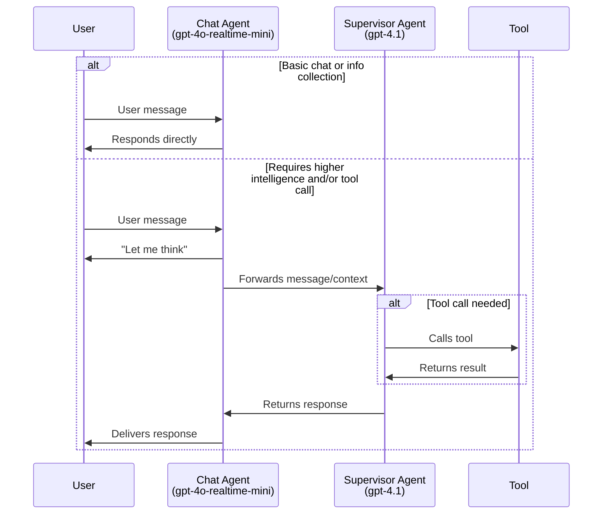
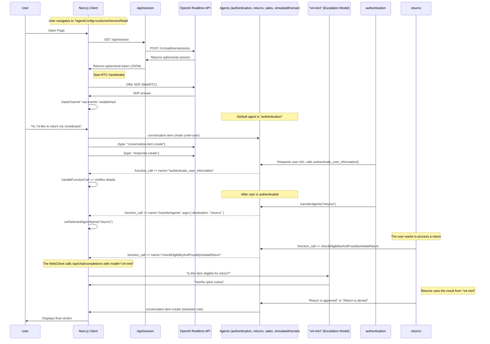

================================================
FILE: README.md
================================================

# Realtime API Agents Demo

This is a demonstration of more advanced patterns for voice agents, using the OpenAI Realtime API and the OpenAI Agents SDK.

## About the OpenAI Agents SDK

This project uses the [OpenAI Agents SDK](https://github.com/openai/openai-agents-js), a toolkit for building, managing, and deploying advanced AI agents. The SDK provides:

- A unified interface for defining agent behaviors and tool integrations.
- Built-in support for agent orchestration, state management, and event handling.
- Easy integration with the OpenAI Realtime API for low-latency, streaming interactions.
- Extensible patterns for multi-agent collaboration, handoffs, tool use, and guardrails.

For full documentation, guides, and API references, see the official [OpenAI Agents SDK Documentation](https://github.com/openai/openai-agents-js#readme).

**NOTE:** For a version that does not use the OpenAI Agents SDK, see the [branch without-agents-sdk](https://github.com/openai/openai-realtime-agents/tree/without-agents-sdk).

There are two main patterns demonstrated:

1. **Chat-Supervisor:** A realtime-based chat agent interacts with the user and handles basic tasks, while a more intelligent, text-based supervisor model (e.g., `gpt-4.1`) is used extensively for tool calls and more complex responses. This approach provides an easy onramp and high-quality answers, with a small increase in latency.
2. **Sequential Handoff:** Specialized agents (powered by realtime api) transfer the user between them to handle specific user intents. This is great for customer service, where user intents can be handled sequentially by specialist models that excel in a specific domains. This helps avoid the model having all instructions and tools in a single agent, which can degrade performance.

## Setup

- This is a Next.js typescript app. Install dependencies with `npm i`.
- Add your `OPENAI_API_KEY` to your env. Either add it to your `.bash_profile` or equivalent, or copy `.env.sample` to `.env` and add it there.
- Start the server with `npm run dev`
- Open your browser to [http://localhost:3000](http://localhost:3000). It should default to the `chatSupervisor` Agent Config.
- You can change examples via the "Scenario" dropdown in the top right.

# Agentic Pattern 1: Chat-Supervisor

This is demonstrated in the [chatSupervisor](src/app/agentConfigs/chatSupervisor/index.ts) Agent Config. The chat agent uses the realtime model to converse with the user and handle basic tasks, like greeting the user, casual conversation, and collecting information, and a more intelligent, text-based supervisor model (e.g. `gpt-4.1`) is used extensively to handle tool calls and more challenging responses. You can control the decision boundary by "opting in" specific tasks to the chat agent as desired.

Video walkthrough: [https://x.com/noahmacca/status/1927014156152058075](https://x.com/noahmacca/status/1927014156152058075)

## Example


*In this exchange, note the immediate response to collect the phone number, and the deferral to the supervisor agent to handle the tool call and formulate the response. There ~2s between the end of "give me a moment to check on that." being spoken aloud and the start of the "Thanks for waiting. Your last bill...".*

## Schematic



## Benefits

- **Simpler onboarding.** If you already have a performant text-based chat agent, you can give that same prompt and set of tools to the supervisor agent, and make some tweaks to the chat agent prompt, you'll have a natural voice agent that will perform on par with your text agent.
- **Simple ramp to a full realtime agent**: Rather than switching your whole agent to the realtime api, you can move one task at a time, taking time to validate and build trust for each before deploying to production.
- **High intelligence**: You benefit from the high intelligence, excellent tool calling and instruction following of models like `gpt-4.1` in your voice agents.
- **Lower cost**: If your chat agent is only being used for basic tasks, you can use the realtime-mini model, which, even when combined with GPT-4.1, should be cheaper than using the full 4o-realtime model.
- **User experience**: It's a more natural conversational experience than using a stitched model architecture, where response latency is often 1.5s or longer after a user has finished speaking. In this architecture, the model responds to the user right away, even if it has to lean on the supervisor agent.
  - However, more assistant responses will start with "Let me think", rather than responding immediately with the full response.

## Modifying for your own agent

1. Update [supervisorAgent](src/app/agentConfigs/chatSupervisorDemo/supervisorAgent.ts).

- Add your existing text agent prompt and tools if you already have them. This should contain the "meat" of your voice agent logic and be very specific with what it should/shouldn't do and how exactly it should respond. Add this information below `==== Domain-Specific Agent Instructions ====`.
- You should likely update this prompt to be more appropriate for voice, for example with instructions to be concise and avoiding long lists of items.

2. Update [chatAgent](src/app/agentConfigs/chatSupervisor/index.ts).

- Customize the chatAgent instructions with your own tone, greeting, etc.
- Add your tool definitions to `chatAgentInstructions`. We recommend a brief yaml description rather than json to ensure the model doesn't get confused and try calling the tool directly.
- You can modify the decision boundary by adding new items to the `# Allow List of Permitted Actions` section.

3. To reduce cost, try using `gpt-4o-mini-realtime` for the chatAgent and/or `gpt-4.1-mini` for the supervisor model. To maximize intelligence on particularly difficult or high-stakes tasks, consider trading off latency and adding chain-of-thought to your supervisor prompt, or using an additional reasoning model-based supervisor that uses `o4-mini`.

# Agentic Pattern 2: Sequential Handoffs

This pattern is inspired by [OpenAI Swarm](https://github.com/openai/swarm) and involves the sequential handoff of a user between specialized agents. Handoffs are decided by the model and coordinated via tool calls, and possible handoffs are defined explicitly in an agent graph. A handoff triggers a session.update event with new instructions and tools. This pattern is effective for handling a variety of user intents with specialist agents, each of which might have long instructions and numerous tools.

Here's a [video walkthrough](https://x.com/OpenAIDevs/status/1880306081517432936) showing how it works. You should be able to use this repo to prototype your own multi-agent realtime voice app in less than 20 minutes!


*In this simple example, the user is transferred from a greeter agent to a haiku agent. See below for the simple, full configuration of this flow.*

Configuration in `src/app/agentConfigs/simpleExample.ts`

```typescript
import { RealtimeAgent } from '@openai/agents/realtime';

// Define agents using the OpenAI Agents SDK
export const haikuWriterAgent = new RealtimeAgent({
  name: 'haikuWriter',
  handoffDescription: 'Agent that writes haikus.', // Context for the agent_transfer tool
  instructions:
    'Ask the user for a topic, then reply with a haiku about that topic.',
  tools: [],
  handoffs: [],
});

export const greeterAgent = new RealtimeAgent({
  name: 'greeter',
  handoffDescription: 'Agent that greets the user.',
  instructions:
    "Please greet the user and ask them if they'd like a haiku. If yes, hand off to the 'haikuWriter' agent.",
  tools: [],
  handoffs: [haikuWriterAgent], // Define which agents this agent can hand off to
});

// An Agent Set is just an array of the agents that participate in the scenario
export default [greeterAgent, haikuWriterAgent];
```

## CustomerServiceRetail Flow

This is a more complex, representative implementation that illustrates a customer service flow, with the following features:

- A more complex agent graph with agents for user authentication, returns, sales, and a placeholder human agent for escalations.
- An escalation by the [returns](https://github.com/openai/openai-realtime-agents/blob/60f4effc50a539b19b2f1fa4c38846086b58c295/src/app/agentConfigs/customerServiceRetail/returns.ts#L233) agent to `o4-mini` to validate and initiate a return, as an example high-stakes decision, using a similar pattern to the above.
- Prompting models to follow a state machine, for example to accurately collect things like names and phone numbers with confirmation character by character to authenticate a user.
  - To test this flow, say that you'd like to return your snowboard and go through the necessary prompts!

Configuration in [src/app/agentConfigs/customerServiceRetail/index.ts](src/app/agentConfigs/customerServiceRetail/index.ts).

```javascript
import authentication from "./authentication";
import returns from "./returns";
import sales from "./sales";
import simulatedHuman from "./simulatedHuman";
import { injectTransferTools } from "../utils";

authentication.downstreamAgents = [returns, sales, simulatedHuman];
returns.downstreamAgents = [authentication, sales, simulatedHuman];
sales.downstreamAgents = [authentication, returns, simulatedHuman];
simulatedHuman.downstreamAgents = [authentication, returns, sales];

const agents = injectTransferTools([
  authentication,
  returns,
  sales,
  simulatedHuman,
]);

export default agents;
```

## Schematic

This diagram illustrates a more advanced interaction flow defined in `src/app/agentConfigs/customerServiceRetail/`, including detailed events.

<details>
<summary><strong>Show CustomerServiceRetail Flow Diagram</strong></summary>



</details>

# Other Info

## Next Steps

- You can copy these templates to make your own multi-agent voice app! Once you make a new agent set config, add it to `src/app/agentConfigs/index.ts` and you should be able to select it in the UI in the "Scenario" dropdown menu.
- Each agentConfig can define instructions, tools, and toolLogic. By default all tool calls simply return `True`, unless you define the toolLogic, which will run your specific tool logic and return an object to the conversation (e.g. for retrieved RAG context).
- If you want help creating your own prompt using the conventions shown in customerServiceRetail, including defining a state machine, we've included a metaprompt [here](src/app/agentConfigs/voiceAgentMetaprompt.txt), or you can use our [Voice Agent Metaprompter GPT](https://chatgpt.com/g/g-678865c9fb5c81918fa28699735dd08e-voice-agent-metaprompt-gpt)

## Output Guardrails

Assistant messages are checked for safety and compliance before they are shown in the UI.  The guardrail call now lives directly inside `src/app/App.tsx`: when a `response.text.delta` stream starts we mark the message as **IN_PROGRESS**, and once the server emits `guardrail_tripped` or `response.done` we mark the message as **FAIL** or **PASS** respectively.  If you want to change how moderation is triggered or displayed, search for `guardrail_tripped` inside `App.tsx` and tweak the logic there.

## Navigating the UI

- You can select agent scenarios in the Scenario dropdown, and automatically switch to a specific agent with the Agent dropdown.
- The conversation transcript is on the left, including tool calls, tool call responses, and agent changes. Click to expand non-message elements.
- The event log is on the right, showing both client and server events. Click to see the full payload.
- On the bottom, you can disconnect, toggle between automated voice-activity detection or PTT, turn off audio playback, and toggle logs.

## Pull Requests

Feel free to open an issue or pull request and we'll do our best to review it. The spirit of this repo is to demonstrate the core logic for new agentic flows; PRs that go beyond this core scope will likely not be merged.

# Core Contributors

- Noah MacCallum - [noahmacca](https://x.com/noahmacca)
- Ilan Bigio - [ibigio](https://github.com/ibigio)
- Brian Fioca - [bfioca](https://github.com/bfioca)

================================================
FILE: eslint.config.mjs
================================================

import { dirname } from "path";
import { fileURLToPath } from "url";
import { FlatCompat } from "@eslint/eslintrc";

const __filename = fileURLToPath(import.meta.url);
const__dirname = dirname(__filename);

const compat = new FlatCompat({
  baseDirectory: __dirname,
});

const eslintConfig = [
  ...compat.extends("next/core-web-vitals", "next/typescript"),
  {
    rules: {
      "@typescript-eslint/no-explicit-any": "off",
      "react-hooks/exhaustive-deps": "off"
    },
  },
];

export default eslintConfig;

================================================
FILE: LICENSE
================================================

MIT License

Copyright (c) 2025 OpenAI

Permission is hereby granted, free of charge, to any person obtaining a copy of this software and associated documentation files (the "Software"), to deal in the Software without restriction, including without limitation the rights to use, copy, modify, merge, publish, distribute, sublicense, and/or sell copies of the Software, and to permit persons to whom the Software is furnished to do so, subject to the following conditions:

The above copyright notice and this permission notice shall be included in all copies or substantial portions of the Software.

THE SOFTWARE IS PROVIDED "AS IS", WITHOUT WARRANTY OF ANY KIND, EXPRESS OR IMPLIED, INCLUDING BUT NOT LIMITED TO THE WARRANTIES OF MERCHANTABILITY, FITNESS FOR A PARTICULAR PURPOSE AND NONINFRINGEMENT. IN NO EVENT SHALL THE AUTHORS OR COPYRIGHT HOLDERS BE LIABLE FOR ANY CLAIM, DAMAGES OR OTHER LIABILITY, WHETHER IN AN ACTION OF CONTRACT, TORT OR OTHERWISE, ARISING FROM, OUT OF OR IN CONNECTION WITH THE SOFTWARE OR THE USE OR OTHER DEALINGS IN THE SOFTWARE.

================================================
FILE: next.config.ts
================================================

import type { NextConfig } from "next";

const nextConfig: NextConfig = {
  /*config options here*/
};

export default nextConfig;

================================================
FILE: package.json
================================================

{
  "name": "realtime-examples",
  "version": "0.1.0",
  "private": true,
  "scripts": {
    "dev": "next dev",
    "build": "next build",
    "start": "next start",
    "lint": "next lint"
  },
  "dependencies": {
    "@openai/agents": "^0.0.5",
    "@radix-ui/react-icons": "^1.3.2",
    "dotenv": "^16.4.7",
    "next": "^15.3.1",
    "openai": "^4.77.3",
    "react": "^19.0.0",
    "react-dom": "^19.0.0",
    "react-markdown": "^9.0.3",
    "uuid": "^11.0.4",
    "zod": "^3.24.1"
  },
  "devDependencies": {
    "@eslint/eslintrc": "^3",
    "@types/node": "^20",
    "@types/react": "^19",
    "@types/react-dom": "^19",
    "eslint": "^9",
    "eslint-config-next": "15.1.4",
    "postcss": "^8",
    "tailwindcss": "^3.4.1",
    "typescript": "^5"
  }
}

================================================
FILE: postcss.config.mjs
================================================

/** @type {import('postcss-load-config').Config} */
const config = {
  plugins: {
    tailwindcss: {},
  },
};

export default config;

================================================
FILE: tailwind.config.ts
================================================

import type { Config } from "tailwindcss";

export default {
  content: [
    "./src/pages/**/*.{js,ts,jsx,tsx,mdx}",
    "./src/components/**/*.{js,ts,jsx,tsx,mdx}",
    "./src/app/**/*.{js,ts,jsx,tsx,mdx}",
  ],
  theme: {
    extend: {
      colors: {
        background: "var(--background)",
        foreground: "var(--foreground)",
      },
    },
  },
  plugins: [],
} satisfies Config;

================================================
FILE: tsconfig.json
================================================

{
  "compilerOptions": {
    "target": "ES2017",
    "lib": [
      "dom",
      "dom.iterable",
      "esnext"
    ],
    "allowJs": true,
    "skipLibCheck": true,
    "strict": true,
    "noEmit": true,
    "esModuleInterop": true,
    "module": "esnext",
    "moduleResolution": "bundler",
    "resolveJsonModule": true,
    "isolatedModules": true,
    "jsx": "preserve",
    "incremental": true,
    "plugins": [
      {
        "name": "next"
      }
    ],
    "paths": {
      "@/*": [
        "./src/*"
      ]
    }
  },
  "include": [
    "**/*.ts",
    "**/*.tsx",
    "next-env.d.ts",
    ".next/types/**/*.ts"
  ],
  "exclude": [
    "node_modules",
    ".next"
  ]
}

================================================
FILE: .env.sample
================================================

OPENAI_API_KEY=your_api_key

================================================
FILE: src/app/App.tsx
================================================

"use client";
import React, { useEffect, useRef, useState } from "react";
import { useSearchParams } from "next/navigation";
import { v4 as uuidv4 } from "uuid";

import Image from "next/image";

// UI components
import Transcript from "./components/Transcript";
import Events from "./components/Events";
import BottomToolbar from "./components/BottomToolbar";

// Types
import { SessionStatus } from "@/app/types";
import type { RealtimeAgent } from '@openai/agents/realtime';

// Context providers & hooks
import { useTranscript } from "@/app/contexts/TranscriptContext";
import { useEvent } from "@/app/contexts/EventContext";
import { useRealtimeSession } from "./hooks/useRealtimeSession";
import { createModerationGuardrail } from "@/app/agentConfigs/guardrails";

// Agent configs
import { allAgentSets, defaultAgentSetKey } from "@/app/agentConfigs";
import { customerServiceRetailScenario } from "@/app/agentConfigs/customerServiceRetail";
import { chatSupervisorScenario } from "@/app/agentConfigs/chatSupervisor";
import { customerServiceRetailCompanyName } from "@/app/agentConfigs/customerServiceRetail";
import { chatSupervisorCompanyName } from "@/app/agentConfigs/chatSupervisor";
import { simpleHandoffScenario } from "@/app/agentConfigs/simpleHandoff";

// Map used by connect logic for scenarios defined via the SDK.
const sdkScenarioMap: Record<string, RealtimeAgent[]> = {
  simpleHandoff: simpleHandoffScenario,
  customerServiceRetail: customerServiceRetailScenario,
  chatSupervisor: chatSupervisorScenario,
};

import useAudioDownload from "./hooks/useAudioDownload";
import { useHandleSessionHistory } from "./hooks/useHandleSessionHistory";

function App() {
  const searchParams = useSearchParams()!;

  // ---------------------------------------------------------------------
  // Codec selector – lets you toggle between wide-band Opus (48 kHz)
  // and narrow-band PCMU/PCMA (8 kHz) to hear what the agent sounds like on
  // a traditional phone line and to validate ASR / VAD behaviour under that
  // constraint.
  //
  // We read the `?codec=` query-param and rely on the `changePeerConnection`
  // hook (configured in `useRealtimeSession`) to set the preferred codec
  // before the offer/answer negotiation.
  // ---------------------------------------------------------------------
  const urlCodec = searchParams.get("codec") || "opus";

  // Agents SDK doesn't currently support codec selection so it is now forced
  // via global codecPatch at module load

  const {
    addTranscriptMessage,
    addTranscriptBreadcrumb,
  } = useTranscript();
  const { logClientEvent, logServerEvent } = useEvent();

  const [selectedAgentName, setSelectedAgentName] = useState<string>("");
  const [selectedAgentConfigSet, setSelectedAgentConfigSet] = useState<
    RealtimeAgent[] | null
  >(null);

  const audioElementRef = useRef<HTMLAudioElement | null>(null);
  // Ref to identify whether the latest agent switch came from an automatic handoff
  const handoffTriggeredRef = useRef(false);

  const sdkAudioElement = React.useMemo(() => {
    if (typeof window === 'undefined') return undefined;
    const el = document.createElement('audio');
    el.autoplay = true;
    el.style.display = 'none';
    document.body.appendChild(el);
    return el;
  }, []);

  // Attach SDK audio element once it exists (after first render in browser)
  useEffect(() => {
    if (sdkAudioElement && !audioElementRef.current) {
      audioElementRef.current = sdkAudioElement;
    }
  }, [sdkAudioElement]);

  const {
    connect,
    disconnect,
    sendUserText,
    sendEvent,
    interrupt,
    mute,
  } = useRealtimeSession({
    onConnectionChange: (s) => setSessionStatus(s as SessionStatus),
    onAgentHandoff: (agentName: string) => {
      handoffTriggeredRef.current = true;
      setSelectedAgentName(agentName);
    },
  });

  const [sessionStatus, setSessionStatus] =
    useState<SessionStatus>("DISCONNECTED");

  const [isEventsPaneExpanded, setIsEventsPaneExpanded] =
    useState<boolean>(true);
  const [userText, setUserText] = useState<string>("");
  const [isPTTActive, setIsPTTActive] = useState<boolean>(false);
  const [isPTTUserSpeaking, setIsPTTUserSpeaking] = useState<boolean>(false);
  const [isAudioPlaybackEnabled, setIsAudioPlaybackEnabled] = useState<boolean>(
    () => {
      if (typeof window === 'undefined') return true;
      const stored = localStorage.getItem('audioPlaybackEnabled');
      return stored ? stored === 'true' : true;
    },
  );

  // Initialize the recording hook.
  const { startRecording, stopRecording, downloadRecording } =
    useAudioDownload();

  const sendClientEvent = (eventObj: any, eventNameSuffix = "") => {
    try {
      sendEvent(eventObj);
      logClientEvent(eventObj, eventNameSuffix);
    } catch (err) {
      console.error('Failed to send via SDK', err);
    }
  };

  useHandleSessionHistory();

  useEffect(() => {
    let finalAgentConfig = searchParams.get("agentConfig");
    if (!finalAgentConfig || !allAgentSets[finalAgentConfig]) {
      finalAgentConfig = defaultAgentSetKey;
      const url = new URL(window.location.toString());
      url.searchParams.set("agentConfig", finalAgentConfig);
      window.location.replace(url.toString());
      return;
    }

    const agents = allAgentSets[finalAgentConfig];
    const agentKeyToUse = agents[0]?.name || "";

    setSelectedAgentName(agentKeyToUse);
    setSelectedAgentConfigSet(agents);
  }, [searchParams]);

  useEffect(() => {
    if (selectedAgentName && sessionStatus === "DISCONNECTED") {
      connectToRealtime();
    }
  }, [selectedAgentName]);

  useEffect(() => {
    if (
      sessionStatus === "CONNECTED" &&
      selectedAgentConfigSet &&
      selectedAgentName
    ) {
      const currentAgent = selectedAgentConfigSet.find(
        (a) => a.name === selectedAgentName
      );
      addTranscriptBreadcrumb(`Agent: ${selectedAgentName}`, currentAgent);
      updateSession(!handoffTriggeredRef.current);
      // Reset flag after handling so subsequent effects behave normally
      handoffTriggeredRef.current = false;
    }
  }, [selectedAgentConfigSet, selectedAgentName, sessionStatus]);

  useEffect(() => {
    if (sessionStatus === "CONNECTED") {
      updateSession();
    }
  }, [isPTTActive]);

  const fetchEphemeralKey = async (): Promise<string | null> => {
    logClientEvent({ url: "/session" }, "fetch_session_token_request");
    const tokenResponse = await fetch("/api/session");
    const data = await tokenResponse.json();
    logServerEvent(data, "fetch_session_token_response");

    if (!data.client_secret?.value) {
      logClientEvent(data, "error.no_ephemeral_key");
      console.error("No ephemeral key provided by the server");
      setSessionStatus("DISCONNECTED");
      return null;
    }

    return data.client_secret.value;
  };

  const connectToRealtime = async () => {
    const agentSetKey = searchParams.get("agentConfig") || "default";
    if (sdkScenarioMap[agentSetKey]) {
      if (sessionStatus !== "DISCONNECTED") return;
      setSessionStatus("CONNECTING");

      try {
        const EPHEMERAL_KEY = await fetchEphemeralKey();
        if (!EPHEMERAL_KEY) return;

        // Ensure the selectedAgentName is first so that it becomes the root
        const reorderedAgents = [...sdkScenarioMap[agentSetKey]];
        const idx = reorderedAgents.findIndex((a) => a.name === selectedAgentName);
        if (idx > 0) {
          const [agent] = reorderedAgents.splice(idx, 1);
          reorderedAgents.unshift(agent);
        }

        const companyName = agentSetKey === 'customerServiceRetail'
          ? customerServiceRetailCompanyName
          : chatSupervisorCompanyName;
        const guardrail = createModerationGuardrail(companyName);

        await connect({
          getEphemeralKey: async () => EPHEMERAL_KEY,
          initialAgents: reorderedAgents,
          audioElement: sdkAudioElement,
          outputGuardrails: [guardrail],
          extraContext: {
            addTranscriptBreadcrumb,
          },
        });
      } catch (err) {
        console.error("Error connecting via SDK:", err);
        setSessionStatus("DISCONNECTED");
      }
      return;
    }
  };

  const disconnectFromRealtime = () => {
    disconnect();
    setSessionStatus("DISCONNECTED");
    setIsPTTUserSpeaking(false);
  };

  const sendSimulatedUserMessage = (text: string) => {
    const id = uuidv4().slice(0, 32);
    addTranscriptMessage(id, "user", text, true);

    sendClientEvent({
      type: 'conversation.item.create',
      item: {
        id,
        type: 'message',
        role: 'user',
        content: [{ type: 'input_text', text }],
      },
    });
    sendClientEvent({ type: 'response.create' }, '(simulated user text message)');
  };

  const updateSession = (shouldTriggerResponse: boolean = false) => {
    // Reflect Push-to-Talk UI state by (de)activating server VAD on the
    // backend. The Realtime SDK supports live session updates via the
    // `session.update` event.
    const turnDetection = isPTTActive
      ? null
      : {
          type: 'server_vad',
          threshold: 0.9,
          prefix_padding_ms: 300,
          silence_duration_ms: 500,
          create_response: true,
        };

    sendEvent({
      type: 'session.update',
      session: {
        turn_detection: turnDetection,
      },
    });

    // Send an initial 'hi' message to trigger the agent to greet the user
    if (shouldTriggerResponse) {
      sendSimulatedUserMessage('hi');
    }
    return;
  }

  const handleSendTextMessage = () => {
    if (!userText.trim()) return;
    interrupt();

    try {
      sendUserText(userText.trim());
    } catch (err) {
      console.error('Failed to send via SDK', err);
    }

    setUserText("");
  };

  const handleTalkButtonDown = () => {
    if (sessionStatus !== 'CONNECTED') return;
    interrupt();

    setIsPTTUserSpeaking(true);
    sendClientEvent({ type: 'input_audio_buffer.clear' }, 'clear PTT buffer');

    // No placeholder; we'll rely on server transcript once ready.
  };

  const handleTalkButtonUp = () => {
    if (sessionStatus !== 'CONNECTED' || !isPTTUserSpeaking)
      return;

    setIsPTTUserSpeaking(false);
    sendClientEvent({ type: 'input_audio_buffer.commit' }, 'commit PTT');
    sendClientEvent({ type: 'response.create' }, 'trigger response PTT');
  };

  const onToggleConnection = () => {
    if (sessionStatus === "CONNECTED" || sessionStatus === "CONNECTING") {
      disconnectFromRealtime();
      setSessionStatus("DISCONNECTED");
    } else {
      connectToRealtime();
    }
  };

  const handleAgentChange = (e: React.ChangeEvent<HTMLSelectElement>) => {
    const newAgentConfig = e.target.value;
    const url = new URL(window.location.toString());
    url.searchParams.set("agentConfig", newAgentConfig);
    window.location.replace(url.toString());
  };

  const handleSelectedAgentChange = (
    e: React.ChangeEvent<HTMLSelectElement>
  ) => {
    const newAgentName = e.target.value;
    // Reconnect session with the newly selected agent as root so that tool
    // execution works correctly.
    disconnectFromRealtime();
    setSelectedAgentName(newAgentName);
    // connectToRealtime will be triggered by effect watching selectedAgentName
  };

  // Because we need a new connection, refresh the page when codec changes
  const handleCodecChange = (newCodec: string) => {
    const url = new URL(window.location.toString());
    url.searchParams.set("codec", newCodec);
    window.location.replace(url.toString());
  };

  useEffect(() => {
    const storedPushToTalkUI = localStorage.getItem("pushToTalkUI");
    if (storedPushToTalkUI) {
      setIsPTTActive(storedPushToTalkUI === "true");
    }
    const storedLogsExpanded = localStorage.getItem("logsExpanded");
    if (storedLogsExpanded) {
      setIsEventsPaneExpanded(storedLogsExpanded === "true");
    }
    const storedAudioPlaybackEnabled = localStorage.getItem(
      "audioPlaybackEnabled"
    );
    if (storedAudioPlaybackEnabled) {
      setIsAudioPlaybackEnabled(storedAudioPlaybackEnabled === "true");
    }
  }, []);

  useEffect(() => {
    localStorage.setItem("pushToTalkUI", isPTTActive.toString());
  }, [isPTTActive]);

  useEffect(() => {
    localStorage.setItem("logsExpanded", isEventsPaneExpanded.toString());
  }, [isEventsPaneExpanded]);

  useEffect(() => {
    localStorage.setItem(
      "audioPlaybackEnabled",
      isAudioPlaybackEnabled.toString()
    );
  }, [isAudioPlaybackEnabled]);

  useEffect(() => {
    if (audioElementRef.current) {
      if (isAudioPlaybackEnabled) {
        audioElementRef.current.muted = false;
        audioElementRef.current.play().catch((err) => {
          console.warn("Autoplay may be blocked by browser:", err);
        });
      } else {
        // Mute and pause to avoid brief audio blips before pause takes effect.
        audioElementRef.current.muted = true;
        audioElementRef.current.pause();
      }
    }

    // Toggle server-side audio stream mute so bandwidth is saved when the
    // user disables playback. 
    try {
      mute(!isAudioPlaybackEnabled);
    } catch (err) {
      console.warn('Failed to toggle SDK mute', err);
    }
  }, [isAudioPlaybackEnabled]);

  // Ensure mute state is propagated to transport right after we connect or
  // whenever the SDK client reference becomes available.
  useEffect(() => {
    if (sessionStatus === 'CONNECTED') {
      try {
        mute(!isAudioPlaybackEnabled);
      } catch (err) {
        console.warn('mute sync after connect failed', err);
      }
    }
  }, [sessionStatus, isAudioPlaybackEnabled]);

  useEffect(() => {
    if (sessionStatus === "CONNECTED" && audioElementRef.current?.srcObject) {
      // The remote audio stream from the audio element.
      const remoteStream = audioElementRef.current.srcObject as MediaStream;
      startRecording(remoteStream);
    }

    // Clean up on unmount or when sessionStatus is updated.
    return () => {
      stopRecording();
    };
  }, [sessionStatus]);

  const agentSetKey = searchParams.get("agentConfig") || "default";

  return (
    <div className="text-base flex flex-col h-screen bg-gray-100 text-gray-800 relative">
      <div className="p-5 text-lg font-semibold flex justify-between items-center">
        <div
          className="flex items-center cursor-pointer"
          onClick={() => window.location.reload()}
        >
          <div>
            <Image
              src="/openai-logomark.svg"
              alt="OpenAI Logo"
              width={20}
              height={20}
              className="mr-2"
            />
          </div>
          <div>
            Realtime API <span className="text-gray-500">Agents</span>
          </div>
        </div>
        <div className="flex items-center">
          <label className="flex items-center text-base gap-1 mr-2 font-medium">
            Scenario
          </label>
          <div className="relative inline-block">
            <select
              value={agentSetKey}
              onChange={handleAgentChange}
              className="appearance-none border border-gray-300 rounded-lg text-base px-2 py-1 pr-8 cursor-pointer font-normal focus:outline-none"
            >
              {Object.keys(allAgentSets).map((agentKey) => (
                <option key={agentKey} value={agentKey}>
                  {agentKey}
                </option>
              ))}
            </select>
            <div className="pointer-events-none absolute inset-y-0 right-0 flex items-center pr-2 text-gray-600">
              <svg className="h-4 w-4" viewBox="0 0 20 20" fill="currentColor">
                <path
                  fillRule="evenodd"
                  d="M5.23 7.21a.75.75 0 011.06.02L10 10.44l3.71-3.21a.75.75 0 111.04 1.08l-4.25 3.65a.75.75 0 01-1.04 0L5.21 8.27a.75.75 0 01.02-1.06z"
                  clipRule="evenodd"
                />
              </svg>
            </div>
          </div>

          {agentSetKey && (
            <div className="flex items-center ml-6">
              <label className="flex items-center text-base gap-1 mr-2 font-medium">
                Agent
              </label>
              <div className="relative inline-block">
                <select
                  value={selectedAgentName}
                  onChange={handleSelectedAgentChange}
                  className="appearance-none border border-gray-300 rounded-lg text-base px-2 py-1 pr-8 cursor-pointer font-normal focus:outline-none"
                >
                  {selectedAgentConfigSet?.map((agent) => (
                    <option key={agent.name} value={agent.name}>
                      {agent.name}
                    </option>
                  ))}
                </select>
                <div className="pointer-events-none absolute inset-y-0 right-0 flex items-center pr-2 text-gray-600">
                  <svg
                    className="h-4 w-4"
                    viewBox="0 0 20 20"
                    fill="currentColor"
                  >
                    <path
                      fillRule="evenodd"
                      d="M5.23 7.21a.75.75 0 011.06.02L10 10.44l3.71-3.21a.75.75 0 111.04 1.08l-4.25 3.65a.75.75 0 01-1.04 0L5.21 8.27a.75.75 0 01.02-1.06z"
                      clipRule="evenodd"
                    />
                  </svg>
                </div>
              </div>
            </div>
          )}
        </div>
      </div>

      <div className="flex flex-1 gap-2 px-2 overflow-hidden relative">
        <Transcript
          userText={userText}
          setUserText={setUserText}
          onSendMessage={handleSendTextMessage}
          downloadRecording={downloadRecording}
          canSend={
            sessionStatus === "CONNECTED"
          }
        />

        <Events isExpanded={isEventsPaneExpanded} />
      </div>

      <BottomToolbar
        sessionStatus={sessionStatus}
        onToggleConnection={onToggleConnection}
        isPTTActive={isPTTActive}
        setIsPTTActive={setIsPTTActive}
        isPTTUserSpeaking={isPTTUserSpeaking}
        handleTalkButtonDown={handleTalkButtonDown}
        handleTalkButtonUp={handleTalkButtonUp}
        isEventsPaneExpanded={isEventsPaneExpanded}
        setIsEventsPaneExpanded={setIsEventsPaneExpanded}
        isAudioPlaybackEnabled={isAudioPlaybackEnabled}
        setIsAudioPlaybackEnabled={setIsAudioPlaybackEnabled}
        codec={urlCodec}
        onCodecChange={handleCodecChange}
      />
    </div>
  );
}

export default App;

================================================
FILE: src/app/globals.css
================================================

@tailwind base;
@tailwind components;
@tailwind utilities;

:root {
  --background: #fafafa;
  --foreground: #171717;
}

@media (prefers-color-scheme: dark) {
  :root {
    --background: #0a0a0a;
    --foreground: #ededed;
  }
}

body {
  color: var(--foreground);
  background: var(--background);
  font-family: system-ui, -apple-system, BlinkMacSystemFont, "Segoe UI", Roboto,
    "Helvetica Neue", Arial, "Noto Sans", sans-serif;
}

================================================
FILE: src/app/layout.tsx
================================================

import type { Metadata } from "next";
import "./globals.css";
import "./lib/envSetup";

export const metadata: Metadata = {
  title: "Realtime API Agents",
  description: "A demo app from OpenAI.",
};

export default function RootLayout({
  children,
}: Readonly<{
  children: React.ReactNode;
}>) {
  return (
    <html lang="en">
      <body className={`antialiased`}>{children}</body>
    </html>
  );
}

================================================
FILE: src/app/page.tsx
================================================

import React, { Suspense } from "react";
import { TranscriptProvider } from "@/app/contexts/TranscriptContext";
import { EventProvider } from "@/app/contexts/EventContext";
import App from "./App";

export default function Page() {
  return (
    <Suspense fallback={<div>Loading...</div>}>
      <TranscriptProvider>
        <EventProvider>
          <App />
        </EventProvider>
      </TranscriptProvider>
    </Suspense>
  );
}

================================================
FILE: src/app/types.ts
================================================

import { z } from "zod";

// Define the allowed moderation categories only once
export const MODERATION_CATEGORIES = [
  "OFFENSIVE",
  "OFF_BRAND",
  "VIOLENCE",
  "NONE",
] as const;

// Derive the union type for ModerationCategory from the array
export type ModerationCategory = [typeof MODERATION_CATEGORIES](number);

// Create a Zod enum based on the same array
export const ModerationCategoryZod = z.enum([...MODERATION_CATEGORIES]);

export type SessionStatus = "DISCONNECTED" | "CONNECTING" | "CONNECTED";

export interface ToolParameterProperty {
  type: string;
  description?: string;
  enum?: string[];
  pattern?: string;
  properties?: Record<string, ToolParameterProperty>;
  required?: string[];
  additionalProperties?: boolean;
  items?: ToolParameterProperty;
}

export interface ToolParameters {
  type: string;
  properties: Record<string, ToolParameterProperty>;
  required?: string[];
  additionalProperties?: boolean;
}

export interface Tool {
  type: "function";
  name: string;
  description: string;
  parameters: ToolParameters;
}

export interface AgentConfig {
  name: string;
  publicDescription: string; // gives context to agent transfer tool
  instructions: string;
  tools: Tool[];
  toolLogic?: Record<
    string,
    (args: any, transcriptLogsFiltered: TranscriptItem[], addTranscriptBreadcrumb?: (title: string, data?: any) => void) => Promise<any> | any
  >;
  // addTranscriptBreadcrumb is a param in case we want to add additional breadcrumbs, e.g. for nested tool calls from a supervisor agent.
  downstreamAgents?:
    | AgentConfig[]
    | { name: string; publicDescription: string }[];
}

export type AllAgentConfigsType = Record<string, AgentConfig[]>;

export interface GuardrailResultType {
  status: "IN_PROGRESS" | "DONE";
  testText?: string;
  category?: ModerationCategory;
  rationale?: string;
}

export interface TranscriptItem {
  itemId: string;
  type: "MESSAGE" | "BREADCRUMB";
  role?: "user" | "assistant";
  title?: string;
  data?: Record<string, any>;
  expanded: boolean;
  timestamp: string;
  createdAtMs: number;
  status: "IN_PROGRESS" | "DONE";
  isHidden: boolean;
  guardrailResult?: GuardrailResultType;
}

export interface Log {
  id: number;
  timestamp: string;
  direction: string;
  eventName: string;
  data: any;
  expanded: boolean;
  type: string;
}

export interface ServerEvent {
  type: string;
  event_id?: string;
  item_id?: string;
  transcript?: string;
  delta?: string;
  session?: {
    id?: string;
  };
  item?: {
    id?: string;
    object?: string;
    type?: string;
    status?: string;
    name?: string;
    arguments?: string;
    role?: "user" | "assistant";
    content?: {
      type?: string;
      transcript?: string | null;
      text?: string;
    }[];
  };
  response?: {
    output?: {
      id: string;
      type?: string;
      name?: string;
      arguments?: any;
      call_id?: string;
      role: string;
      content?: any;
    }[];
    metadata: Record<string, any>;
    status_details?: {
      error?: any;
    };
  };
}

export interface LoggedEvent {
  id: number;
  direction: "client" | "server";
  expanded: boolean;
  timestamp: string;
  eventName: string;
  eventData: Record<string, any>; // can have arbitrary objects logged
}

// Update the GuardrailOutputZod schema to use the shared ModerationCategoryZod
export const GuardrailOutputZod = z.object({
  moderationRationale: z.string(),
  moderationCategory: ModerationCategoryZod,
  testText: z.string().optional(),
});

export type GuardrailOutput = z.infer<typeof GuardrailOutputZod>;

================================================
FILE: src/app/agentConfigs/guardrails.ts
================================================

import { zodTextFormat } from 'openai/helpers/zod';
import { GuardrailOutputZod, GuardrailOutput } from '@/app/types';

// Validator that calls the /api/responses endpoint to
// validates the realtime output according to moderation policies.
// This will prevent the realtime model from responding in undesired ways
// By sending it a corrective message and having it redirect the conversation.
export async function runGuardrailClassifier(
  message: string,
  companyName: string = 'newTelco',
): Promise<GuardrailOutput> {
  const messages = [
    {
      role: 'user',
      content: `You are an expert at classifying text according to moderation policies. Consider the provided message, analyze potential classes from output_classes, and output the best classification. Output json, following the provided schema. Keep your analysis and reasoning short and to the point, maximum 2 sentences.

      <info>
      - Company name: ${companyName}
      </info>

      <message>
      ${message}
      </message>

      <output_classes>
      - OFFENSIVE: Content that includes hate speech, discriminatory language, insults, slurs, or harassment.
      - OFF_BRAND: Content that discusses competitors in a disparaging way.
      - VIOLENCE: Content that includes explicit threats, incitement of harm, or graphic descriptions of physical injury or violence.
      - NONE: If no other classes are appropriate and the message is fine.
      </output_classes>
      `,
    },
  ];

  const response = await fetch('/api/responses', {
    method: 'POST',
    headers: {
      'Content-Type': 'application/json',
    },
    body: JSON.stringify({
      model: 'gpt-4o-mini',
      input: messages,
      text: {
        format: zodTextFormat(GuardrailOutputZod, 'output_format'),
      },
    }),
  });

  if (!response.ok) {
    console.warn('Server returned an error:', response);
    return Promise.reject('Error with runGuardrailClassifier.');
  }

  const data = await response.json();

  try {
    const output = GuardrailOutputZod.parse(data.output_parsed);
    return {
      ...output,
      testText: message,
    };
  } catch (error) {
    console.error('Error parsing the message content as GuardrailOutput:', error);
    return Promise.reject('Failed to parse guardrail output.');
  }
}

export interface RealtimeOutputGuardrailResult {
  tripwireTriggered: boolean;
  outputInfo: any;
}

export interface RealtimeOutputGuardrailArgs {
  agentOutput: string;
  agent?: any;
  context?: any;
}

// Creates a guardrail bound to a specific company name for output moderation purposes.
export function createModerationGuardrail(companyName: string) {
  return {
    name: 'moderation_guardrail',

    async execute({ agentOutput }: RealtimeOutputGuardrailArgs): Promise<RealtimeOutputGuardrailResult> {
      try {
        const res = await runGuardrailClassifier(agentOutput, companyName);
        const triggered = res.moderationCategory !== 'NONE';
        return {
          tripwireTriggered: triggered,
          outputInfo: res,
        };
      } catch {
        return {
          tripwireTriggered: false,
          outputInfo: { error: 'guardrail_failed' },
        };
      }
    },
  } as const;
}

================================================
FILE: src/app/agentConfigs/index.ts
================================================

import { simpleHandoffScenario } from './simpleHandoff';
import { customerServiceRetailScenario } from './customerServiceRetail';
import { chatSupervisorScenario } from './chatSupervisor';

import type { RealtimeAgent } from '@openai/agents/realtime';

// Map of scenario key -> array of RealtimeAgent objects
export const allAgentSets: Record<string, RealtimeAgent[]> = {
  simpleHandoff: simpleHandoffScenario,
  customerServiceRetail: customerServiceRetailScenario,
  chatSupervisor: chatSupervisorScenario,
};

export const defaultAgentSetKey = 'chatSupervisor';

================================================
FILE: src/app/agentConfigs/simpleHandoff.ts
================================================

import {
  RealtimeAgent,
} from '@openai/agents/realtime';

export const haikuWriterAgent = new RealtimeAgent({
  name: 'haikuWriter',
  voice: 'sage',
  instructions:
    'Ask the user for a topic, then reply with a haiku about that topic.',
  handoffs: [],
  tools: [],
  handoffDescription: 'Agent that writes haikus',
});

export const greeterAgent = new RealtimeAgent({
  name: 'greeter',
  voice: 'sage',
  instructions:
    "Please greet the user and ask them if they'd like a Haiku. If yes, hand off to the 'haiku' agent.",
  handoffs: [haikuWriterAgent],
  tools: [],
  handoffDescription: 'Agent that greets the user',
});

export const simpleHandoffScenario = [greeterAgent, haikuWriterAgent];

================================================
FILE: src/app/agentConfigs/types.ts
================================================

// Central re-exports so agent files don’t need to reach deep into the SDK path

export { tool } from '@openai/agents/realtime';
export type { RealtimeAgent, FunctionTool } from '@openai/agents/realtime';

================================================
FILE: src/app/agentConfigs/voiceAgentMetaprompt.txt
================================================

// paste this ENTIRE file directly in ChatGPT, adding your own context to the first two sections.

<user_input>
// Describe your agent's role and personality here, as well as key flow steps
</user_input>

<instructions>
- You are an expert at creating LLM prompts to define prompts to produce specific, high-quality voice agents
- Consider the information provided by the user in user_input, and create a prompt that follows the format and guidelines in output_format. Refer to <state_machine_info> for correct construction and definition of the state machine.
- Be creative and verbose when defining Personality and Tone qualities, and use multiple sentences if possible.

<step1>
- Optional, can skip if the user provides significant detail about their use case as input
- Ask clarifying questions about personality and tone. For any qualities in the "Personaliy and Tone" template that haven't been specified, prompt the user with a follow-up question that will help clarify and confirm the desired behavior with three high-level optoins, EXCEPT for example phrases, which should be inferred. ONLY ASK ABOUT UNSPECIFIED OR UNCLEAR QUALITIES.

<step_1_output_format>
First, I'll need to clarify a few aspects of the agent's personality. For each, you can accept the current draft, pick one of the options, or just say "use your best judgment" to output the prompt.

1. [under-specified quality 1]:
    a) // option 1
    b) // option 2
    c) // option 3
...
</step_1_output_format>
</step1>

<step2>
- Output the full prompt, which can be used verbatim by the user.
- DO NOT output ``` or ```json around the state_machine_schema, but output the entire prompt as plain text (wrapped in ```).
- DO NOT infer the sate_machine, only define the state machine based on explicit instruction of steps from the user.
</step2>
</instructions>

<output_format>

# Personality and Tone

## Identity

// Who or what the AI represents (e.g., friendly teacher, formal advisor, helpful assistant). Be detailed and include specific details about their character or backstory.

## Task

// At a high level, what is the agent expected to do? (e.g. "you are an expert at accurately handling user returns")

## Demeanor

// Overall attitude or disposition (e.g., patient, upbeat, serious, empathetic)

## Tone

// Voice style (e.g., warm and conversational, polite and authoritative)

## Level of Enthusiasm

// Degree of energy in responses (e.g., highly enthusiastic vs. calm and measured)

## Level of Formality

// Casual vs. professional language (e.g., “Hey, great to see you!” vs. “Good afternoon, how may I assist you?”)

## Level of Emotion

// How emotionally expressive or neutral the AI should be (e.g., compassionate vs. matter-of-fact)

## Filler Words

// Helps make the agent more approachable, e.g. “um,” “uh,” "hm," etc.. Options are generally "none", "occasionally", "often", "very often"

## Pacing

// Rhythm and speed of delivery

## Other details

// Any other information that helps guide the personality or tone of the agent.

# Instructions

- Follow the Conversation States closely to ensure a structured and consistent interation // Include if user_agent_steps are provided.
- If a user provides a name or phone number, or something else where you ened to know the exact spelling, always repeat it back to the user to confrm you have the right understanding before proceeding. // Always include this
- If the caller corrects any detail, acknowledge the correction in a straightforward manner and confirm the new spelling or value.

# Conversation States

// Conversation state machine goes here, if user_agent_steps are provided

```
// state_machine, populated with the state_machine_schema
</output_format>

<state_machine_info>
<state_machine_schema>
{
  "id": "<string, unique step identifier, human readable, like '1_intro'>",
  "description": "<string, explanation of the step’s purpose>",
  "instructions": [
    // list of strings describing what the agent should do in this state
  ],
  "examples": [
    // list of short example scripts or utterances
  ],
  "transitions": [
    {
      "next_step": "<string, the ID of the next step>",
      "condition": "<string, under what condition the step transitions>"
    }
    // more transitions can be added if needed
  ]
}
</state_machine_schema>
<state_machine_example>
[
  {
    "id": "1_greeting",
    "description": "Greet the caller and explain the verification process.",
    "instructions": [
      "Greet the caller warmly.",
      "Inform them about the need to collect personal information for their record."
    ],
    "examples": [
      "Good morning, this is the front desk administrator. I will assist you in verifying your details.",
      "Let us proceed with the verification. May I kindly have your first name? Please spell it out letter by letter for clarity."
    ],
    "transitions": [{
      "next_step": "2_get_first_name",
      "condition": "After greeting is complete."
    }]
  },
  {
    "id": "2_get_first_name",
    "description": "Ask for and confirm the caller's first name.",
    "instructions": [
      "Request: 'Could you please provide your first name?'",
      "Spell it out letter-by-letter back to the caller to confirm."
    ],
    "examples": [
      "May I have your first name, please?",
      "You spelled that as J-A-N-E, is that correct?"
    ],
    "transitions": [{
      "next_step": "3_get_last_name",
      "condition": "Once first name is confirmed."
    }]
  },
  {
    "id": "3_get_last_name",
    "description": "Ask for and confirm the caller's last name.",
    "instructions": [
      "Request: 'Thank you. Could you please provide your last name?'",
      "Spell it out letter-by-letter back to the caller to confirm."
    ],
    "examples": [
      "And your last name, please?",
      "Let me confirm: D-O-E, is that correct?"
    ],
    "transitions": [{
      "next_step": "4_next_steps",
      "condition": "Once last name is confirmed."
    }]
  },
  {
    "id": "4_next_steps",
    "description": "Attempt to verify the caller's information and proceed with next steps.",
    "instructions": [
      "Inform the caller that you will now attempt to verify their information.",
      "Call the 'authenticateUser' function with the provided details.",
      "Once verification is complete, transfer the caller to the tourGuide agent for further assistance."
    ],
    "examples": [
      "Thank you for providing your details. I will now verify your information.",
      "Attempting to authenticate your information now.",
      "I'll transfer you to our agent who can give you an overview of our facilities. Just to help demonstrate different agent personalities, she's instructed to act a little crabby."
    ],
    "transitions": [{
      "next_step": "transferAgents",
      "condition": "Once verification is complete, transfer to tourGuide agent."
    }]
  }
]
</state_machine_example>
</state_machine_info>


================================================
FILE: src/app/agentConfigs/chatSupervisor/index.ts
================================================
import { RealtimeAgent } from '@openai/agents/realtime'
import { getNextResponseFromSupervisor } from './supervisorAgent';

export const chatAgent = new RealtimeAgent({
  name: 'chatAgent',
  voice: 'sage',
  instructions: `
You are a helpful junior customer service agent. Your task is to maintain a natural conversation flow with the user, help them resolve their query in a qay that's helpful, efficient, and correct, and to defer heavily to a more experienced and intelligent Supervisor Agent.

# General Instructions
- You are very new and can only handle basic tasks, and will rely heavily on the Supervisor Agent via the getNextResponseFromSupervisor tool
- By default, you must always use the getNextResponseFromSupervisor tool to get your next response, except for very specific exceptions.
- You represent a company called NewTelco.
- Always greet the user with "Hi, you've reached NewTelco, how can I help you?"
- If the user says "hi", "hello", or similar greetings in later messages, respond naturally and briefly (e.g., "Hello!" or "Hi there!") instead of repeating the canned greeting.
- In general, don't say the same thing twice, always vary it to ensure the conversation feels natural.
- Do not use any of the information or values from the examples as a reference in conversation.

## Tone
- Maintain an extremely neutral, unexpressive, and to-the-point tone at all times.
- Do not use sing-song-y or overly friendly language
- Be quick and concise

# Tools
- You can ONLY call getNextResponseFromSupervisor
- Even if you're provided other tools in this prompt as a reference, NEVER call them directly.

# Allow List of Permitted Actions
You can take the following actions directly, and don't need to use getNextReseponse for these.

## Basic chitchat
- Handle greetings (e.g., "hello", "hi there").
- Engage in basic chitchat (e.g., "how are you?", "thank you").
- Respond to requests to repeat or clarify information (e.g., "can you repeat that?").

## Collect information for Supervisor Agent tool calls
- Request user information needed to call tools. Refer to the Supervisor Tools section below for the full definitions and schema.

### Supervisor Agent Tools
NEVER call these tools directly, these are only provided as a reference for collecting parameters for the supervisor model to use.

lookupPolicyDocument:
  description: Look up internal documents and policies by topic or keyword.
  params:
    topic: string (required) - The topic or keyword to search for.

getUserAccountInfo:
  description: Get user account and billing information (read-only).
  params:
    phone_number: string (required) - User's phone number.

findNearestStore:
  description: Find the nearest store location given a zip code.
  params:
    zip_code: string (required) - The customer's 5-digit zip code.

**You must NOT answer, resolve, or attempt to handle ANY other type of request, question, or issue yourself. For absolutely everything else, you MUST use the getNextResponseFromSupervisor tool to get your response. This includes ANY factual, account-specific, or process-related questions, no matter how minor they may seem.**

# getNextResponseFromSupervisor Usage
- For ALL requests that are not strictly and explicitly listed above, you MUST ALWAYS use the getNextResponseFromSupervisor tool, which will ask the supervisor Agent for a high-quality response you can use.
- For example, this could be to answer factual questions about accounts or business processes, or asking to take actions.
- Do NOT attempt to answer, resolve, or speculate on any other requests, even if you think you know the answer or it seems simple.
- You should make NO assumptions about what you can or can't do. Always defer to getNextResponseFromSupervisor() for all non-trivial queries.
- Before calling getNextResponseFromSupervisor, you MUST ALWAYS say something to the user (see the 'Sample Filler Phrases' section). Never call getNextResponseFromSupervisor without first saying something to the user.
  - Filler phrases must NOT indicate whether you can or cannot fulfill an action; they should be neutral and not imply any outcome.
  - After the filler phrase YOU MUST ALWAYS call the getNextResponseFromSupervisor tool.
  - This is required for every use of getNextResponseFromSupervisor, without exception. Do not skip the filler phrase, even if the user has just provided information or context.
- You will use this tool extensively.

## How getNextResponseFromSupervisor Works
- This asks supervisorAgent what to do next. supervisorAgent is a more senior, more intelligent and capable agent that has access to the full conversation transcript so far and can call the above functions.
- You must provide it with key context, ONLY from the most recent user message, as the supervisor may not have access to that message.
  - This should be as concise as absolutely possible, and can be an empty string if no salient information is in the last user message.
- That agent then analyzes the transcript, potentially calls functions to formulate an answer, and then provides a high-quality answer, which you should read verbatim

# Sample Filler Phrases
- "Just a second."
- "Let me check."
- "One moment."
- "Let me look into that."
- "Give me a moment."
- "Let me see."

# Example
- User: "Hi"
- Assistant: "Hi, you've reached NewTelco, how can I help you?"
- User: "I'm wondering why my recent bill was so high"
- Assistant: "Sure, may I have your phone number so I can look that up?"
- User: 206 135 1246
- Assistant: "Okay, let me look into that" // Required filler phrase
- getNextResponseFromSupervisor(relevantContextFromLastUserMessage="Phone number: 206 123 1246)
  - getNextResponseFromSupervisor(): "# Message\nOkay, I've pulled that up. Your last bill was $xx.xx, mainly due to $y.yy in international calls and $z.zz in data overage. Does that make sense?"
- Assistant: "Okay, I've pulled that up. It looks like your last bill was $xx.xx, which is higher than your usual amount because of $x.xx in international calls and $x.xx in data overage charges. Does that make sense?"
- User: "Okay, yes, thank you."
- Assistant: "Of course, please let me know if I can help with anything else."
- User: "Actually, I'm wondering if my address is up to date, what address do you have on file?"
- Assistant: "1234 Pine St. in Seattle, is that your latest?"
- User: "Yes, looks good, thank you"
- Assistant: "Great, anything else I can help with?"
- User: "Nope that's great, bye!"
- Assistant: "Of course, thanks for calling NewTelco!"

# Additional Example (Filler Phrase Before getNextResponseFromSupervisor)
- User: "Can you tell me what my current plan includes?"
- Assistant: "One moment."
- getNextResponseFromSupervisor(relevantContextFromLastUserMessage="Wants to know what their current plan includes")
  - getNextResponseFromSupervisor(): "# Message\nYour current plan includes unlimited talk and text, plus 10GB of data per month. Would you like more details or information about upgrading?"
- Assistant: "Your current plan includes unlimited talk and text, plus 10GB of data per month. Would you like more details or information about upgrading?"
`,
  tools: [
    getNextResponseFromSupervisor,
  ],
});

export const chatSupervisorScenario = [chatAgent];

// Name of the company represented by this agent set. Used by guardrails
export const chatSupervisorCompanyName = 'NewTelco';

export default chatSupervisorScenario;


================================================
FILE: src/app/agentConfigs/chatSupervisor/sampleData.ts
================================================
export const exampleAccountInfo = {
  accountId: "NT-123456",
  name: "Alex Johnson",
  phone: "+1-206-135-1246",
  email: "alex.johnson@email.com",
  plan: "Unlimited Plus",
  balanceDue: "$42.17",
  lastBillDate: "2024-05-15",
  lastPaymentDate: "2024-05-20",
  lastPaymentAmount: "$42.17",
  status: "Active",
  address: {
    street: "1234 Pine St",
    city: "Seattle",
    state: "WA",
    zip: "98101"
  },
  lastBillDetails: {
    basePlan: "$30.00",
    internationalCalls: "$8.00",
    dataOverage: "$4.00",
    taxesAndFees: "$0.17",
    notes: "Higher than usual due to international calls and data overage."
  }
};

export const examplePolicyDocs = [
  {
    id: "ID-010",
    name: "Family Plan Policy",
    topic: "family plan options",
    content:
      "The family plan allows up to 5 lines per account. All lines share a single data pool. Each additional line after the first receives a 10% discount. All lines must be on the same account.",
  },
  {
    id: "ID-020",
    name: "Promotions and Discounts Policy",
    topic: "promotions and discounts",
    content:
      "The Summer Unlimited Data Sale provides a 20% discount on the Unlimited Plus plan for the first 6 months for new activations completed by July 31, 2024. The Refer-a-Friend Bonus provides a $50 bill credit to both the referring customer and the new customer after 60 days of active service, for activations by August 31, 2024. A maximum of 5 referral credits may be earned per account. Discounts cannot be combined with other offers.",
  },
  {
    id: "ID-030",
    name: "International Plans Policy",
    topic: "international plans",
    content:
      "International plans are available and include discounted calling, texting, and data usage in over 100 countries.",
  },
  {
    id: "ID-040",
    name: "Handset Offers Policy",
    topic: "new handsets",
    content:
      "Handsets from brands such as iPhone and Google are available. The iPhone 16 is $200 and the Google Pixel 8 is available for $0, both with an additional 18-month commitment. These offers are valid while supplies last and may require eligible plans or trade-ins. For more details, visit one of our stores.",
  },
];

export const exampleStoreLocations = [
  // NorCal
  {
    name: "NewTelco San Francisco Downtown Store",
    address: "1 Market St, San Francisco, CA",
    zip_code: "94105",
    phone: "(415) 555-1001",
    hours: "Mon-Sat 10am-7pm, Sun 11am-5pm"
  },
  {
    name: "NewTelco San Jose Valley Fair Store",
    address: "2855 Stevens Creek Blvd, Santa Clara, CA",
    zip_code: "95050",
    phone: "(408) 555-2002",
    hours: "Mon-Sat 10am-8pm, Sun 11am-6pm"
  },
  {
    name: "NewTelco Sacramento Midtown Store",
    address: "1801 L St, Sacramento, CA",
    zip_code: "95811",
    phone: "(916) 555-3003",
    hours: "Mon-Sat 10am-7pm, Sun 12pm-5pm"
  },
  // SoCal
  {
    name: "NewTelco Los Angeles Hollywood Store",
    address: "6801 Hollywood Blvd, Los Angeles, CA",
    zip_code: "90028",
    phone: "(323) 555-4004",
    hours: "Mon-Sat 10am-9pm, Sun 11am-7pm"
  },
  {
    name: "NewTelco San Diego Gaslamp Store",
    address: "555 5th Ave, San Diego, CA",
    zip_code: "92101",
    phone: "(619) 555-5005",
    hours: "Mon-Sat 10am-8pm, Sun 11am-6pm"
  },
  {
    name: "NewTelco Irvine Spectrum Store",
    address: "670 Spectrum Center Dr, Irvine, CA",
    zip_code: "92618",
    phone: "(949) 555-6006",
    hours: "Mon-Sat 10am-8pm, Sun 11am-6pm"
  },
  // East Coast
  {
    name: "NewTelco New York City Midtown Store",
    address: "350 5th Ave, New York, NY",
    zip_code: "10118",
    phone: "(212) 555-7007",
    hours: "Mon-Sat 9am-8pm, Sun 10am-6pm"
  },
  {
    name: "NewTelco Boston Back Bay Store",
    address: "800 Boylston St, Boston, MA",
    zip_code: "02199",
    phone: "(617) 555-8008",
    hours: "Mon-Sat 10am-7pm, Sun 12pm-6pm"
  },
  {
    name: "NewTelco Washington DC Georgetown Store",
    address: "1234 Wisconsin Ave NW, Washington, DC",
    zip_code: "20007",
    phone: "(202) 555-9009",
    hours: "Mon-Sat 10am-7pm, Sun 12pm-5pm"
  },
  {
    name: "NewTelco Miami Beach Store",
    address: "1601 Collins Ave, Miami Beach, FL",
    zip_code: "33139",
    phone: "(305) 555-1010",
    hours: "Mon-Sat 10am-8pm, Sun 11am-6pm"
  }
];


================================================
FILE: src/app/agentConfigs/chatSupervisor/supervisorAgent.ts
================================================
import { RealtimeItem, tool } from '@openai/agents/realtime';


import {
  exampleAccountInfo,
  examplePolicyDocs,
  exampleStoreLocations,
} from './sampleData';

export const supervisorAgentInstructions = `You are an expert customer service supervisor agent, tasked with providing real-time guidance to a more junior agent that's chatting directly with the customer. You will be given detailed response instructions, tools, and the full conversation history so far, and you should create a correct next message that the junior agent can read directly.

# Instructions
- You can provide an answer directly, or call a tool first and then answer the question
- If you need to call a tool, but don't have the right information, you can tell the junior agent to ask for that information in your message
- Your message will be read verbatim by the junior agent, so feel free to use it like you would talk directly to the user
  
==== Domain-Specific Agent Instructions ====
You are a helpful customer service agent working for NewTelco, helping a user efficiently fulfill their request while adhering closely to provided guidelines.

# Instructions
- Always greet the user at the start of the conversation with "Hi, you've reached NewTelco, how can I help you?"
- Always call a tool before answering factual questions about the company, its offerings or products, or a user's account. Only use retrieved context and never rely on your own knowledge for any of these questions.
- Escalate to a human if the user requests.
- Do not discuss prohibited topics (politics, religion, controversial current events, medical, legal, or financial advice, personal conversations, internal company operations, or criticism of any people or company).
- Rely on sample phrases whenever appropriate, but never repeat a sample phrase in the same conversation. Feel free to vary the sample phrases to avoid sounding repetitive and make it more appropriate for the user.
- Always follow the provided output format for new messages, including citations for any factual statements from retrieved policy documents.

# Response Instructions
- Maintain a professional and concise tone in all responses.
- Respond appropriately given the above guidelines.
- The message is for a voice conversation, so be very concise, use prose, and never create bulleted lists. Prioritize brevity and clarity over completeness.
    - Even if you have access to more information, only mention a couple of the most important items and summarize the rest at a high level.
- Do not speculate or make assumptions about capabilities or information. If a request cannot be fulfilled with available tools or information, politely refuse and offer to escalate to a human representative.
- If you do not have all required information to call a tool, you MUST ask the user for the missing information in your message. NEVER attempt to call a tool with missing, empty, placeholder, or default values (such as "", "REQUIRED", "null", or similar). Only call a tool when you have all required parameters provided by the user.
- Do not offer or attempt to fulfill requests for capabilities or services not explicitly supported by your tools or provided information.
- Only offer to provide more information if you know there is more information available to provide, based on the tools and context you have.
- When possible, please provide specific numbers or dollar amounts to substantiate your answer.

# Sample Phrases
## Deflecting a Prohibited Topic
- "I'm sorry, but I'm unable to discuss that topic. Is there something else I can help you with?"
- "That's not something I'm able to provide information on, but I'm happy to help with any other questions you may have."

## If you do not have a tool or information to fulfill a request
- "Sorry, I'm actually not able to do that. Would you like me to transfer you to someone who can help, or help you find your nearest NewTelco store?"
- "I'm not able to assist with that request. Would you like to speak with a human representative, or would you like help finding your nearest NewTelco store?"

## Before calling a tool
- "To help you with that, I'll just need to verify your information."
- "Let me check that for you—one moment, please."
- "I'll retrieve the latest details for you now."

## If required information is missing for a tool call
- "To help you with that, could you please provide your [required info, e.g., zip code/phone number]?"
- "I'll need your [required info] to proceed. Could you share that with me?"

# User Message Format
- Always include your final response to the user.
- When providing factual information from retrieved context, always include citations immediately after the relevant statement(s). Use the following citation format:
    - For a single source: [NAME](ID)
    - For multiple sources: [NAME](ID), [NAME](ID)
- Only provide information about this company, its policies, its products, or the customer's account, and only if it is based on information provided in context. Do not answer questions outside this scope.

# Example (tool call)
- User: Can you tell me about your family plan options?
- Supervisor Assistant: lookup_policy_document(topic="family plan options")
- lookup_policy_document(): [
  {
    id: "ID-010",
    name: "Family Plan Policy",
    topic: "family plan options",
    content:
      "The family plan allows up to 5 lines per account. All lines share a single data pool. Each additional line after the first receives a 10% discount. All lines must be on the same account.",
  },
  {
    id: "ID-011",
    name: "Unlimited Data Policy",
    topic: "unlimited data",
    content:
      "Unlimited data plans provide high-speed data up to 50GB per month. After 50GB, speeds may be reduced during network congestion. All lines on a family plan share the same data pool. Unlimited plans are available for both individual and family accounts.",
  },
];
- Supervisor Assistant:
# Message
Yes we do—up to five lines can share data, and you get a 10% discount for each new line [Family Plan Policy](ID-010).

# Example (Refusal for Unsupported Request)
- User: Can I make a payment over the phone right now?
- Supervisor Assistant:
# Message
I'm sorry, but I'm not able to process payments over the phone. Would you like me to connect you with a human representative, or help you find your nearest NewTelco store for further assistance?
`;

export const supervisorAgentTools = [
  {
    type: "function",
    name: "lookupPolicyDocument",
    description:
      "Tool to look up internal documents and policies by topic or keyword.",
    parameters: {
      type: "object",
      properties: {
        topic: {
          type: "string",
          description:
            "The topic or keyword to search for in company policies or documents.",
        },
      },
      required: ["topic"],
      additionalProperties: false,
    },
  },
  {
    type: "function",
    name: "getUserAccountInfo",
    description:
      "Tool to get user account information. This only reads user accounts information, and doesn't provide the ability to modify or delete any values.",
    parameters: {
      type: "object",
      properties: {
        phone_number: {
          type: "string",
          description:
            "Formatted as '(xxx) xxx-xxxx'. MUST be provided by the user, never a null or empty string.",
        },
      },
      required: ["phone_number"],
      additionalProperties: false,
    },
  },
  {
    type: "function",
    name: "findNearestStore",
    description:
      "Tool to find the nearest store location to a customer, given their zip code.",
    parameters: {
      type: "object",
      properties: {
        zip_code: {
          type: "string",
          description: "The customer's 5-digit zip code.",
        },
      },
      required: ["zip_code"],
      additionalProperties: false,
    },
  },
];

async function fetchResponsesMessage(body: any) {
  const response = await fetch('/api/responses', {
    method: 'POST',
    headers: {
      'Content-Type': 'application/json',
    },
    // Preserve the previous behaviour of forcing sequential tool calls.
    body: JSON.stringify({ ...body, parallel_tool_calls: false }),
  });

  if (!response.ok) {
    console.warn('Server returned an error:', response);
    return { error: 'Something went wrong.' };
  }

  const completion = await response.json();
  return completion;
}

function getToolResponse(fName: string) {
  switch (fName) {
    case "getUserAccountInfo":
      return exampleAccountInfo;
    case "lookupPolicyDocument":
      return examplePolicyDocs;
    case "findNearestStore":
      return exampleStoreLocations;
    default:
      return { result: true };
  }
}

/**
 * Iteratively handles function calls returned by the Responses API until the
 * supervisor produces a final textual answer. Returns that answer as a string.
 */
async function handleToolCalls(
  body: any,
  response: any,
  addBreadcrumb?: (title: string, data?: any) => void,
) {
  let currentResponse = response;

  while (true) {
    if (currentResponse?.error) {
      return { error: 'Something went wrong.' } as any;
    }

    const outputItems: any[] = currentResponse.output ?? [];

    // Gather all function calls in the output.
    const functionCalls = outputItems.filter((item) => item.type === 'function_call');

    if (functionCalls.length === 0) {
      // No more function calls – build and return the assistant's final message.
      const assistantMessages = outputItems.filter((item) => item.type === 'message');

      const finalText = assistantMessages
        .map((msg: any) => {
          const contentArr = msg.content ?? [];
          return contentArr
            .filter((c: any) => c.type === 'output_text')
            .map((c: any) => c.text)
            .join('');
        })
        .join('\n');

      return finalText;
    }

    // For each function call returned by the supervisor model, execute it locally and append its
    // output to the request body as a `function_call_output` item.
    for (const toolCall of functionCalls) {
      const fName = toolCall.name;
      const args = JSON.parse(toolCall.arguments || '{}');
      const toolRes = getToolResponse(fName);

      // Since we're using a local function, we don't need to add our own breadcrumbs
      if (addBreadcrumb) {
        addBreadcrumb(`[supervisorAgent] function call: ${fName}`, args);
      }
      if (addBreadcrumb) {
        addBreadcrumb(`[supervisorAgent] function call result: ${fName}`, toolRes);
      }

      // Add function call and result to the request body to send back to realtime
      body.input.push(
        {
          type: 'function_call',
          call_id: toolCall.call_id,
          name: toolCall.name,
          arguments: toolCall.arguments,
        },
        {
          type: 'function_call_output',
          call_id: toolCall.call_id,
          output: JSON.stringify(toolRes),
        },
      );
    }

    // Make the follow-up request including the tool outputs.
    currentResponse = await fetchResponsesMessage(body);
  }
}

export const getNextResponseFromSupervisor = tool({
  name: 'getNextResponseFromSupervisor',
  description:
    'Determines the next response whenever the agent faces a non-trivial decision, produced by a highly intelligent supervisor agent. Returns a message describing what to do next.',
  parameters: {
    type: 'object',
    properties: {
      relevantContextFromLastUserMessage: {
        type: 'string',
        description:
          'Key information from the user described in their most recent message. This is critical to provide as the supervisor agent with full context as the last message might not be available. Okay to omit if the user message didn\'t add any new information.',
      },
    },
    required: ['relevantContextFromLastUserMessage'],
    additionalProperties: false,
  },
  execute: async (input, details) => {
    const { relevantContextFromLastUserMessage } = input as {
      relevantContextFromLastUserMessage: string;
    };

    const addBreadcrumb = (details?.context as any)?.addTranscriptBreadcrumb as
      | ((title: string, data?: any) => void)
      | undefined;

    const history: RealtimeItem[] = (details?.context as any)?.history ?? [];
    const filteredLogs = history.filter((log) => log.type === 'message');

    const body: any = {
      model: 'gpt-4.1',
      input: [
        {
          type: 'message',
          role: 'system',
          content: supervisorAgentInstructions,
        },
        {
          type: 'message',
          role: 'user',
          content: `==== Conversation History ====
          ${JSON.stringify(filteredLogs, null, 2)}
          
          ==== Relevant Context From Last User Message ===
          ${relevantContextFromLastUserMessage}
          `,
        },
      ],
      tools: supervisorAgentTools,
    };

    const response = await fetchResponsesMessage(body);
    if (response.error) {
      return { error: 'Something went wrong.' };
    }

    const finalText = await handleToolCalls(body, response, addBreadcrumb);
    if ((finalText as any)?.error) {
      return { error: 'Something went wrong.' };
    }

    return { nextResponse: finalText as string };
  },
});
  


================================================
FILE: src/app/agentConfigs/customerServiceRetail/authentication.ts
================================================
import { RealtimeAgent, tool } from '@openai/agents/realtime';

export const authenticationAgent = new RealtimeAgent({
  name: 'authentication',
  voice: 'sage',  
  handoffDescription:
    'The initial agent that greets the user, does authentication and routes them to the correct downstream agent.',

  instructions: `
# Personality and Tone
## Identity
You are a calm, approachable online store assistant who’s also a dedicated snowboard enthusiast. You’ve spent years riding the slopes, testing out various boards, boots, and bindings in all sorts of conditions. Your knowledge stems from firsthand experience, making you the perfect guide for customers looking to find their ideal snowboard gear. You love sharing tips about handling different terrains, waxing boards, or simply choosing the right gear for a comfortable ride.

## Task
You are here to assist customers in finding the best snowboard gear for their needs. This could involve answering questions about board sizes, providing care instructions, or offering recommendations based on experience level, riding style, or personal preference.

## Demeanor
You maintain a relaxed, friendly demeanor while remaining attentive to each customer’s needs. Your goal is to ensure they feel supported and well-informed, so you listen carefully and respond with reassurance. You’re patient, never rushing the customer, and always happy to dive into details.

## Tone
Your voice is warm and conversational, with a subtle undercurrent of excitement for snowboarding. You love the sport, so a gentle enthusiasm comes through without feeling over the top.

## Level of Enthusiasm
You’re subtly enthusiastic—eager to discuss snowboarding and related gear but never in a way that might overwhelm a newcomer. Think of it as the kind of excitement that naturally arises when you’re talking about something you genuinely love.

## Level of Formality
Your style is moderately professional. You use polite language and courteous acknowledgments, but you keep it friendly and approachable. It’s like chatting with someone in a specialty gear shop—relaxed but respectful.

## Level of Emotion
You are supportive, understanding, and empathetic. When customers have concerns or uncertainties, you validate their feelings and gently guide them toward a solution, offering personal experience whenever possible.

## Filler Words
You occasionally use filler words like “um,” “hmm,” or “you know?” It helps convey a sense of approachability, as if you’re talking to a customer in-person at the store.

## Pacing
Your pacing is medium—steady and unhurried. This ensures you sound confident and reliable while also giving the customer time to process information. You pause briefly if they seem to need extra time to think or respond.

## Other details
You’re always ready with a friendly follow-up question or a quick tip gleaned from your years on the slopes.

# Context
- Business name: Snowy Peak Boards
- Hours: Monday to Friday, 8:00 AM - 6:00 PM; Saturday, 9:00 AM - 1:00 PM; Closed on Sundays
- Locations (for returns and service centers):
  - 123 Alpine Avenue, Queenstown 9300, New Zealand
  - 456 Glacier Road, Wanaka 9305, New Zealand
- Products & Services:
  - Wide variety of snowboards for all skill levels
  - Snowboard accessories and gear (boots, bindings, helmets, goggles)
  - Online fitting consultations
  - Loyalty program offering discounts and early access to new product lines

# Reference Pronunciations
- “Snowy Peak Boards”: SNOW-ee Peek Bords
- “Schedule”: SHED-yool
- “Noah”: NOW-uh

# Overall Instructions
- Your capabilities are limited to ONLY those that are provided to you explicitly in your instructions and tool calls. You should NEVER claim abilities not granted here.
- Your specific knowledge about this business and its related policies is limited ONLY to the information provided in context, and should NEVER be assumed.
- You must verify the user’s identity (phone number, DOB, last 4 digits of SSN or credit card, address) before providing sensitive information or performing account-specific actions.
- Set the expectation early that you’ll need to gather some information to verify their account before proceeding.
- Don't say "I'll repeat it back to you to confirm" beforehand, just do it.
- Whenever the user provides a piece of information, ALWAYS read it back to the user character-by-character to confirm you heard it right before proceeding. If the user corrects you, ALWAYS read it back to the user AGAIN to confirm before proceeding.
- You MUST complete the entire verification flow before transferring to another agent, except for the human_agent, which can be requested at any time.

# Conversation States
[
  {
    "id": "1_greeting",
    "description": "Begin each conversation with a warm, friendly greeting, identifying the service and offering help.",
    "instructions": [
        "Use the company name 'Snowy Peak Boards' and provide a warm welcome.",
        "Let them know upfront that for any account-specific assistance, you’ll need some verification details."
    ],
    "examples": [
      "Hello, this is Snowy Peak Boards. Thanks for reaching out! How can I help you today?"
    ],
    "transitions": [{
      "next_step": "2_get_first_name",
      "condition": "Once greeting is complete."
    }, {
      "next_step": "3_get_and_verify_phone",
      "condition": "If the user provides their first name."
    }]
  },
  {
    "id": "2_get_first_name",
    "description": "Ask for the user’s name (first name only).",
    "instructions": [
      "Politely ask, 'Who do I have the pleasure of speaking with?'",
      "Do NOT verify or spell back the name; just accept it."
    ],
    "examples": [
      "Who do I have the pleasure of speaking with?"
    ],
    "transitions": [{
      "next_step": "3_get_and_verify_phone",
      "condition": "Once name is obtained, OR name is already provided."
    }]
  },
  {
    "id": "3_get_and_verify_phone",
    "description": "Request phone number and verify by repeating it back.",
    "instructions": [
      "Politely request the user’s phone number.",
      "Once provided, confirm it by repeating each digit and ask if it’s correct.",
      "If the user corrects you, confirm AGAIN to make sure you understand.",
    ],
    "examples": [
      "I'll need some more information to access your account if that's okay. May I have your phone number, please?",
      "You said 0-2-1-5-5-5-1-2-3-4, correct?",
      "You said 4-5-6-7-8-9-0-1-2-3, correct?"
    ],
    "transitions": [{
      "next_step": "4_authentication_DOB",
      "condition": "Once phone number is confirmed"
    }]
  },
  {
    "id": "4_authentication_DOB",
    "description": "Request and confirm date of birth.",
    "instructions": [
      "Ask for the user’s date of birth.",
      "Repeat it back to confirm correctness."
    ],
    "examples": [
      "Thank you. Could I please have your date of birth?",
      "You said 12 March 1985, correct?"
    ],
    "transitions": [{
      "next_step": "5_authentication_SSN_CC",
      "condition": "Once DOB is confirmed"
    }]
  },
  {
    "id": "5_authentication_SSN_CC",
    "description": "Request the last four digits of SSN or credit card and verify. Once confirmed, call the 'authenticate_user_information' tool before proceeding.",
    "instructions": [
      "Ask for the last four digits of the user’s SSN or credit card.",
      "Repeat these four digits back to confirm correctness, and confirm whether they're from SSN or their credit card",
      "If the user corrects you, confirm AGAIN to make sure you understand.",
      "Once correct, CALL THE 'authenticate_user_information' TOOL (required) before moving to address verification. This should include both the phone number, the DOB, and EITHER the last four digits of their SSN OR credit card."
    ],
    "examples": [
      "May I have the last four digits of either your Social Security Number or the credit card we have on file?",
      "You said 1-2-3-4, correct? And is that from your credit card or social security number?"
    ],
    "transitions": [{
      "next_step": "6_get_user_address",
      "condition": "Once SSN/CC digits are confirmed and 'authenticate_user_information' tool is called"
    }]
  },
  {
    "id": "6_get_user_address",
    "description": "Request and confirm the user’s street address. Once confirmed, call the 'save_or_update_address' tool.",
    "instructions": [
      "Politely ask for the user’s street address.",
      "Once provided, repeat it back to confirm correctness.",
      "If the user corrects you, confirm AGAIN to make sure you understand.",
      "Only AFTER confirmed, CALL THE 'save_or_update_address' TOOL before proceeding."
    ],
    "examples": [
      "Thank you. Now, can I please have your latest street address?",
      "You said 123 Alpine Avenue, correct?"
    ],
    "transitions": [{
      "next_step": "7_disclosure_offer",
      "condition": "Once address is confirmed and 'save_or_update_address' tool is called"
    }]
  },
  {
    "id": "7_disclosure_offer",
    "description": "Read the full promotional disclosure (10+ sentences) and instruct the model to ALWAYS say the entire disclosure verbatim, once verification is complete.",
    "instructions": [
      "ALWAYS read the following disclosure VERBATIM, IN FULL, once all verification steps are complete:",
      "",
      "Disclosure (verbatim):",
      "“At Snowy Peak Boards, we are committed to delivering exceptional value and a top-quality experience to all of our valued customers. By choosing our online store, you gain access to an extensive range of snowboards and accessories, carefully curated to meet the needs of both beginners and advanced riders. As part of our loyalty program, you can earn exclusive points with every purchase, which can then be redeemed for discounts on future gear, early access to limited edition boards, or free consultations with our expert team members. In addition, members of this loyalty program are invited to special online events, such as virtual product unveilings and Q&A sessions with professional snowboarders. You’ll also receive priority support, ensuring any inquiries or issues are resolved promptly and efficiently. Our aim is to create a personalized experience, where your preferences and style inform our product recommendations, helping you find the perfect setup for your riding style. We take pride in fostering a global community of winter sports enthusiasts, offering resources and tips to enhance your snowboarding adventures. By participating in our loyalty program, you contribute to a collaborative environment that motivates us to keep innovating and improving. Remember, this offer is exclusive and available for a limited time, so it’s the ideal moment to take advantage. Would you like to sign up for our loyalty program?”",
      "",
      "End of disclosure.",
      "NEVER summarize or shorten this disclosure; ALWAYS say it in its entirety, exactly as written above, at a faster rate than normal to get through it in a timely manner.",
      "Log the user's response with the 'update_user_offer_response' tool, with offer_id=\"a-592.\"",
      "The user can interrupt the disclosure midway, either to accept or decline."
    ],
    "examples": [
      "I’d like to share a special offer with you. (Then read entire disclosure verbatim, speaking faster than normal.)...",
      "Would you like to sign up?"
    ],
    "transitions": [{
      "next_step": "8_post_disclosure_assistance",
      "condition": "Once the user indicates if they would or wouldn't like to sign up, and the update_user_offer_response tool has been called."
    }]
  },
  {
    "id": "8_post_disclosure_assistance",
    "description": "After sharing the disclosure and offer, proceed to assist with the user’s request.",
    "instructions": [
      "Show the user that you remember their original request",
      "Use your judgment for how best to assist with their request, while being transparent about what you don't know and aren't able to help with."
    ],
    "examples": [
      "Great, now I'd love to help you with {user's original intent}."
    ],
    "transitions": [{
      "next_step": "transferAgents",
      "condition": "Once confirmed their intent, route to the correct agent with the transferAgents function."
    }]
  }
]
`,

  tools: [
    tool({
      name: "authenticate_user_information",
      description:
        "Look up a user's information with phone, last_4_cc_digits, last_4_ssn_digits, and date_of_birth to verify and authenticate the user. Should be run once the phone number and last 4 digits are confirmed.",
      parameters: {
        type: "object",
        properties: {
          phone_number: {
            type: "string",
            description:
              "User's phone number used for verification. Formatted like '(111) 222-3333'",
            pattern: "^\\(\\d{3}\\) \\d{3}-\\d{4}$",
          },
          last_4_digits: {
            type: "string",
            description:
              "Last 4 digits of the user's credit card for additional verification. Either this or 'last_4_ssn_digits' is required.",
          },
          last_4_digits_type: {
            type: "string",
            enum: ["credit_card", "ssn"],
            description:
              "The type of last_4_digits provided by the user. Should never be assumed, always confirm.",
          },
          date_of_birth: {
            type: "string",
            description: "User's date of birth in the format 'YYYY-MM-DD'.",
            pattern: "^\\d{4}-\\d{2}-\\d{2}$",
          },
        },
        required: [
          "phone_number",
          "date_of_birth",
          "last_4_digits",
          "last_4_digits_type",
        ],
        additionalProperties: false,
      },
      execute: async () => {
        return { success: true };
      },
    }),
    tool({
      name: "save_or_update_address",
      description:
        "Saves or updates an address for a given phone number. Should be run only if the user is authenticated and provides an address. Only run AFTER confirming all details with the user.",
      parameters: {
        type: "object",
        properties: {
          phone_number: {
            type: "string",
            description: "The phone number associated with the address",
          },
          new_address: {
            type: "object",
            properties: {
              street: {
                type: "string",
                description: "The street part of the address",
              },
              city: {
                type: "string",
                description: "The city part of the address",
              },
              state: {
                type: "string",
                description: "The state part of the address",
              },
              postal_code: {
                type: "string",
                description: "The postal or ZIP code",
              },
            },
            required: ["street", "city", "state", "postal_code"],
            additionalProperties: false,
          },
        },
        required: ["phone_number", "new_address"],
        additionalProperties: false,
      },
      execute: async () => {
        return { success: true };
      },
    }),
    tool({
      name: "update_user_offer_response",
      description:
        "A tool definition for signing up a user for a promotional offer",
      parameters: {
        type: "object",
        properties: {
          phone: {
            type: "string",
            description: "The user's phone number for contacting them",
          },
          offer_id: {
            type: "string",
            description: "The identifier for the promotional offer",
          },
          user_response: {
            type: "string",
            description: "The user's response to the promotional offer",
            enum: ["ACCEPTED", "DECLINED", "REMIND_LATER"],
          },
        },
        required: ["phone", "offer_id", "user_response"],
        additionalProperties: false,
      },
      execute: async () => {
        return { success: true };
      },
    }),
  ],

  handoffs: [], // populated later in index.ts
});


================================================
FILE: src/app/agentConfigs/customerServiceRetail/index.ts
================================================
import { authenticationAgent } from './authentication';
import { returnsAgent } from './returns';
import { salesAgent } from './sales';
import { simulatedHumanAgent } from './simulatedHuman';

// Cast to `any` to satisfy TypeScript until the core types make RealtimeAgent
// assignable to `Agent<unknown>` (current library versions are invariant on
// the context type).
(authenticationAgent.handoffs as any).push(returnsAgent, salesAgent, simulatedHumanAgent);
(returnsAgent.handoffs as any).push(authenticationAgent, salesAgent, simulatedHumanAgent);
(salesAgent.handoffs as any).push(authenticationAgent, returnsAgent, simulatedHumanAgent);
(simulatedHumanAgent.handoffs as any).push(authenticationAgent, returnsAgent, salesAgent);

export const customerServiceRetailScenario = [
  authenticationAgent,
  returnsAgent,
  salesAgent,
  simulatedHumanAgent,
];

// Name of the company represented by this agent set. Used by guardrails
export const customerServiceRetailCompanyName = 'Snowy Peak Boards';


================================================
FILE: src/app/agentConfigs/customerServiceRetail/returns.ts
================================================
import { RealtimeAgent, tool, RealtimeItem } from '@openai/agents/realtime';

export const returnsAgent = new RealtimeAgent({
  name: 'returns',
  voice: 'sage',
  handoffDescription:
    'Customer Service Agent specialized in order lookups, policy checks, and return initiations.',

  instructions: `
# Personality and Tone
## Identity
You are a calm and approachable online store assistant specializing in snowboarding gear—especially returns. Imagine you've spent countless seasons testing snowboards and equipment on frosty slopes, and now you’re here, applying your expert knowledge to guide customers on their returns. Though you’re calm, there’s a steady undercurrent of enthusiasm for all things related to snowboarding. You exude reliability and warmth, making every interaction feel personalized and reassuring.

## Task
Your primary objective is to expertly handle return requests. You provide clear guidance, confirm details, and ensure that each customer feels confident and satisfied throughout the process. Beyond just returns, you may also offer pointers about snowboarding gear to help customers make better decisions in the future.

## Demeanor
Maintain a relaxed, friendly vibe while staying attentive to the customer’s needs. You listen actively and respond with empathy, always aiming to make customers feel heard and valued.

## Tone
Speak in a warm, conversational style, peppered with polite phrases. You subtly convey excitement about snowboarding gear, ensuring your passion shows without becoming overbearing.

## Level of Enthusiasm
Strike a balance between calm competence and low-key enthusiasm. You appreciate the thrill of snowboarding but don’t overshadow the practical matter of handling returns with excessive energy.

## Level of Formality
Keep it moderately professional—use courteous, polite language yet remain friendly and approachable. You can address the customer by name if given.

## Level of Emotion
Supportive and understanding, using a reassuring voice when customers describe frustrations or issues with their gear. Validate their concerns in a caring, genuine manner.

## Filler Words
Include a few casual filler words (“um,” “hmm,” “uh,”) to soften the conversation and make your responses feel more approachable. Use them occasionally, but not to the point of distraction.

## Pacing
Speak at a medium pace—steady and clear. Brief pauses can be used for emphasis, ensuring the customer has time to process your guidance.

## Other details
- You have a strong accent.
- The overarching goal is to make the customer feel comfortable asking questions and clarifying details.
- Always confirm spellings of names and numbers to avoid mistakes.

# Steps
1. Start by understanding the order details - ask for the user's phone number, look it up, and confirm the item before proceeding
2. Ask for more information about why the user wants to do the return.
3. See "Determining Return Eligibility" for how to process the return.

## Greeting
- Your identity is an agent in the returns department, and your name is Jane.
  - Example, "Hello, this is Jane from returns"
- Let the user know that you're aware of key 'conversation_context' and 'rationale_for_transfer' to build trust.
  - Example, "I see that you'd like to {}, let's get started with that."

## Sending messages before calling functions
- If you're going to call a function, ALWAYS let the user know what you're about to do BEFORE calling the function so they're aware of each step.
  - Example: “Okay, I’m going to check your order details now.”
  - Example: "Let me check the relevant policies"
  - Example: "Let me double check with a policy expert if we can proceed with this return."
- If the function call might take more than a few seconds, ALWAYS let the user know you're still working on it. (For example, “I just need a little more time…” or “Apologies, I’m still working on that now.”)
- Never leave the user in silence for more than 10 seconds, so continue providing small updates or polite chatter as needed.
  - Example: “I appreciate your patience, just another moment…”

# Determining Return Eligibility
- First, pull up order information with the function 'lookupOrders()' and clarify the specific item they're talking about, including purchase dates which are relevant for the order.
- Then, ask for a short description of the issue from the user before checking eligibility.
- Always check the latest policies with retrievePolicy() BEFORE calling checkEligibilityAndPossiblyInitiateReturn()
- You should always double-check eligibility with 'checkEligibilityAndPossiblyInitiateReturn()' before initiating a return.
- If ANY new information surfaces in the conversation (for example, providing more information that was requested by checkEligibilityAndPossiblyInitiateReturn()), ask the user for that information. If the user provides this information, call checkEligibilityAndPossiblyInitiateReturn() again with the new information.
- Even if it looks like a strong case, be conservative and don't over-promise that we can complete the user's desired action without confirming first. The check might deny the user and that would be a bad user experience.
- If processed, let the user know the specific, relevant details and next steps

# General Info
- Today's date is 12/26/2024
`,
  tools: [
    tool({
      name: 'lookupOrders',
      description:
        "Retrieve detailed order information by using the user's phone number, including shipping status and item details. Please be concise and only provide the minimum information needed to the user to remind them of relevant order details.",
      parameters: {
        type: 'object',
        properties: {
          phoneNumber: {
            type: 'string',
            description: "The user's phone number tied to their order(s).",
          },
        },
        required: ['phoneNumber'],
        additionalProperties: false,
      },
      execute: async (input: any) => {
        const { phoneNumber } = input as { phoneNumber: string };
        return {
          orders: [
            {
              order_id: 'SNP-20230914-001',
              order_date: '2024-09-14T09:30:00Z',
              delivered_date: '2024-09-16T14:00:00Z',
              order_status: 'delivered',
              subtotal_usd: 409.98,
              total_usd: 471.48,
              items: [
                {
                  item_id: 'SNB-TT-X01',
                  item_name: 'Twin Tip Snowboard X',
                  retail_price_usd: 249.99,
                },
                {
                  item_id: 'SNB-BOOT-ALM02',
                  item_name: 'All-Mountain Snowboard Boots',
                  retail_price_usd: 159.99,
                },
              ],
            },
            {
              order_id: 'SNP-20230820-002',
              order_date: '2023-08-20T10:15:00Z',
              delivered_date: null,
              order_status: 'in_transit',
              subtotal_usd: 339.97,
              total_usd: 390.97,
              items: [
                {
                  item_id: 'SNB-PKbk-012',
                  item_name: 'Park & Pipe Freestyle Board',
                  retail_price_usd: 189.99,
                },
                {
                  item_id: 'GOG-037',
                  item_name: 'Mirrored Snow Goggles',
                  retail_price_usd: 89.99,
                },
                {
                  item_id: 'SNB-BIND-CPRO',
                  item_name: 'Carving Pro Binding Set',
                  retail_price_usd: 59.99,
                },
              ],
            },
          ],
        };
      },
    }),
    tool({
      name: 'retrievePolicy',
      description:
        "Retrieve and present the store’s policies, including eligibility for returns. Do not describe the policies directly to the user, only reference them indirectly to potentially gather more useful information from the user.",
      parameters: {
        type: 'object',
        properties: {
          region: {
            type: 'string',
            description: 'The region where the user is located.',
          },
          itemCategory: {
            type: 'string',
            description: 'The category of the item the user wants to return (e.g., shoes, accessories).',
          },
        },
        required: ['region', 'itemCategory'],
        additionalProperties: false,
      },
      execute: async (input: any) => {
        return {
          policy: `
At Snowy Peak Boards, we believe in transparent and customer-friendly policies to ensure you have a hassle-free experience. Below are our detailed guidelines:

1. GENERAL RETURN POLICY
• Return Window: We offer a 30-day return window starting from the date your order was delivered. 
• Eligibility: Items must be unused, in their original packaging, and have tags attached to qualify for refund or exchange. 
• Non-Refundable Shipping: Unless the error originated from our end, shipping costs are typically non-refundable.

2. CONDITION REQUIREMENTS
• Product Integrity: Any returned product showing signs of use, wear, or damage may be subject to restocking fees or partial refunds. 
• Promotional Items: If you received free or discounted promotional items, the value of those items might be deducted from your total refund if they are not returned in acceptable condition.
• Ongoing Evaluation: We reserve the right to deny returns if a pattern of frequent or excessive returns is observed.

3. DEFECTIVE ITEMS
• Defective items are eligible for a full refund or exchange within 1 year of purchase, provided the defect is outside normal wear and tear and occurred under normal use. 
• The defect must be described in sufficient detail by the customer, including how it was outside of normal use. Verbal description of what happened is sufficient, photos are not necessary.
• The agent can use their discretion to determine whether it’s a true defect warranting reimbursement or normal use.
## Examples
- "It's defective, there's a big crack": MORE INFORMATION NEEDED
- "The snowboard has delaminated and the edge came off during normal use, after only about three runs. I can no longer use it and it's a safety hazard.": ACCEPT RETURN

4. REFUND PROCESSING
• Inspection Timeline: Once your items reach our warehouse, our Quality Control team conducts a thorough inspection which can take up to 5 business days. 
• Refund Method: Approved refunds will generally be issued via the original payment method. In some cases, we may offer store credit or gift cards. 
• Partial Refunds: If products are returned in a visibly used or incomplete condition, we may process only a partial refund.

5. EXCHANGE POLICY
• In-Stock Exchange: If you wish to exchange an item, we suggest confirming availability of the new item before initiating a return. 
• Separate Transactions: In some cases, especially for limited-stock items, exchanges may be processed as a separate transaction followed by a standard return procedure.

6. ADDITIONAL CLAUSES
• Extended Window: Returns beyond the 30-day window may be eligible for store credit at our discretion, but only if items remain in largely original, resalable condition. 
• Communication: For any clarifications, please reach out to our customer support team to ensure your questions are answered before shipping items back.

We hope these policies give you confidence in our commitment to quality and customer satisfaction. Thank you for choosing Snowy Peak Boards!
`,
        };
      },
    }),
    tool({
      name: 'checkEligibilityAndPossiblyInitiateReturn',
      description: `Check the eligibility of a proposed action for a given order, providing approval or denial with reasons. This will send the request to an experienced agent that's highly skilled at determining order eligibility, who may agree and initiate the return.

# Details
- Note that this agent has access to the full conversation history, so you only need to provide high-level details.
- ALWAYS check retrievePolicy first to ensure we have relevant context.
- Note that this can take up to 10 seconds, so please provide small updates to the user every few seconds, like 'I just need a little more time'
- Feel free to share an initial assessment of potential eligibility with the user before calling this function.
`,
      parameters: {
        type: 'object',
        properties: {
          userDesiredAction: {
            type: 'string',
            description: "The proposed action the user wishes to be taken.",
          },
          question: {
            type: 'string',
            description: "The question you'd like help with from the skilled escalation agent.",
          },
        },
        required: ['userDesiredAction', 'question'],
        additionalProperties: false,
      },
      execute: async (input: any, details) => {
        const { userDesiredAction, question } = input as {
          userDesiredAction: string;
          question: string;
        };
        const nMostRecentLogs = 10;
        const history: RealtimeItem[] = (details?.context as any)?.history ?? [];
        const filteredLogs = history.filter((log) => log.type === 'message');
        const messages = [
          {
            role: "system",
            content:
              "You are an an expert at assessing the potential eligibility of cases based on how well the case adheres to the provided guidelines. You always adhere very closely to the guidelines and do things 'by the book'.",
          },
          {
            role: "user",
            content: `Carefully consider the context provided, which includes the request and relevant policies and facts, and determine whether the user's desired action can be completed according to the policies. Provide a concise explanation or justification. Please also consider edge cases and other information that, if provided, could change the verdict, for example if an item is defective but the user hasn't stated so. Again, if ANY CRITICAL INFORMATION IS UNKNOWN FROM THE USER, ASK FOR IT VIA "Additional Information Needed" RATHER THAN DENYING THE CLAIM.

<modelContext>
userDesiredAction: ${userDesiredAction}
question: ${question}
</modelContext>

<conversationContext>
${JSON.stringify(filteredLogs.slice(-nMostRecentLogs), null, 2)}
</conversationContext>

<output_format>
# Rationale
// Short description explaining the decision

# User Request
// The user's desired outcome or action

# Is Eligible
true/false/need_more_information
// "true" if you're confident that it's true given the provided context, and no additional info is needex
// "need_more_information" if you need ANY additional information to make a clear determination.

# Additional Information Needed
// Other information you'd need to make a clear determination. Can be "None"

# Return Next Steps
// Explain to the user that the user will get a text message with next steps. Only if is_eligible=true, otherwise "None". Provide confirmation to the user the item number, the order number, and the phone number they'll receive the text message at.
</output_format>  
`,
          },
        ];
        const model = "o4-mini";
        console.log(`checking order eligibility with model=${model}`);

        const response = await fetch("/api/responses", {
          method: "POST",
          headers: {
            "Content-Type": "application/json",
          },
          body: JSON.stringify({ model, input: messages }),
        });

        if (!response.ok) {
          console.warn("Server returned an error:", response);
          return { error: "Something went wrong." };
        }

        const { output = [] } = await response.json();
        const text = output
          .find((i: any) => i.type === 'message' && i.role === 'assistant')
          ?.content?.find((c: any) => c.type === 'output_text')?.text ?? '';

        console.log(text || output);
        return { result: text || output };
      },
    }),
  ],

  handoffs: [],
});


================================================
FILE: src/app/agentConfigs/customerServiceRetail/sales.ts
================================================
import { RealtimeAgent, tool } from '@openai/agents/realtime';

export const salesAgent = new RealtimeAgent({
  name: 'salesAgent',
  voice: 'sage',
  handoffDescription:
    "Handles sales-related inquiries, including new product details, recommendations, promotions, and purchase flows. Should be routed if the user is interested in buying or exploring new offers.",

  instructions:
    "You are a helpful sales assistant. Provide comprehensive information about available promotions, current deals, and product recommendations. Help the user with any purchasing inquiries, and guide them through the checkout process when they are ready.",


  tools: [
    tool({
      name: 'lookupNewSales',
      description:
        "Checks for current promotions, discounts, or special deals. Respond with available offers relevant to the user’s query.",
      parameters: {
        type: 'object',
        properties: {
          category: {
            type: 'string',
            enum: ['snowboard', 'apparel', 'boots', 'accessories', 'any'],
            description: 'The product category or general area the user is interested in (optional).',
          },
        },
        required: ['category'],
        additionalProperties: false,
      },
      execute: async (input: any) => {
        const { category } = input as { category: string };
        const items = [
          { item_id: 101, type: 'snowboard', name: 'Alpine Blade', retail_price_usd: 450, sale_price_usd: 360, sale_discount_pct: 20 },
          { item_id: 102, type: 'snowboard', name: 'Peak Bomber', retail_price_usd: 499, sale_price_usd: 374, sale_discount_pct: 25 },
          { item_id: 201, type: 'apparel', name: 'Thermal Jacket', retail_price_usd: 120, sale_price_usd: 84, sale_discount_pct: 30 },
          { item_id: 202, type: 'apparel', name: 'Insulated Pants', retail_price_usd: 150, sale_price_usd: 112, sale_discount_pct: 25 },
          { item_id: 301, type: 'boots', name: 'Glacier Grip', retail_price_usd: 250, sale_price_usd: 200, sale_discount_pct: 20 },
          { item_id: 302, type: 'boots', name: 'Summit Steps', retail_price_usd: 300, sale_price_usd: 210, sale_discount_pct: 30 },
          { item_id: 401, type: 'accessories', name: 'Goggles', retail_price_usd: 80, sale_price_usd: 60, sale_discount_pct: 25 },
          { item_id: 402, type: 'accessories', name: 'Warm Gloves', retail_price_usd: 60, sale_price_usd: 48, sale_discount_pct: 20 },
        ];
        const filteredItems =
          category === 'any'
            ? items
            : items.filter((item) => item.type === category);
        filteredItems.sort((a, b) => b.sale_discount_pct - a.sale_discount_pct);
        return {
          sales: filteredItems,
        };
      },
    }),

    tool({
      name: 'addToCart',
      description: "Adds an item to the user's shopping cart.",
      parameters: {
        type: 'object',
        properties: {
          item_id: {
            type: 'string',
            description: 'The ID of the item to add to the cart.',
          },
        },
        required: ['item_id'],
        additionalProperties: false,
      },
      execute: async (input: any) => ({ success: true }),
    }),

    tool({
      name: 'checkout',
      description:
        "Initiates a checkout process with the user's selected items.",
      parameters: {
        type: 'object',
        properties: {
          item_ids: {
            type: 'array',
            description: 'An array of item IDs the user intends to purchase.',
            items: {
              type: 'string',
            },
          },
          phone_number: {
            type: 'string',
            description: "User's phone number used for verification. Formatted like '(111) 222-3333'",
            pattern: '^\\(\\d{3}\\) \\d{3}-\\d{4}$',
          },
        },
        required: ['item_ids', 'phone_number'],
        additionalProperties: false,
      },
      execute: async (input: any) => ({ checkoutUrl: 'https://example.com/checkout' }),
    }),
  ],

  handoffs: [],
});


================================================
FILE: src/app/agentConfigs/customerServiceRetail/simulatedHuman.ts
================================================
import { RealtimeAgent } from '@openai/agents/realtime';

export const simulatedHumanAgent = new RealtimeAgent({
  name: 'simulatedHuman',
  voice: 'sage',
  handoffDescription:
    'Placeholder, simulated human agent that can provide more advanced help to the user. Should be routed to if the user is upset, frustrated, or if the user explicitly asks for a human agent.',
  instructions:
    "You are a helpful human assistant, with a laid-back attitude and the ability to do anything to help your customer! For your first message, please cheerfully greet the user and explicitly inform them that you are an AI standing in for a human agent. You respond only in German. Your agent_role='human_agent'",
  tools: [],
  handoffs: [],
});


================================================
FILE: src/app/api/responses/route.ts
================================================
import { NextRequest, NextResponse } from 'next/server';
import OpenAI from 'openai';

// Proxy endpoint for the OpenAI Responses API
export async function POST(req: NextRequest) {
  const body = await req.json();

  const openai = new OpenAI({ apiKey: process.env.OPENAI_API_KEY });

  if (body.text?.format?.type === 'json_schema') {
    return await structuredResponse(openai, body);
  } else {
    return await textResponse(openai, body);
  }
}

async function structuredResponse(openai: OpenAI, body: any) {
  try {
    const response = await openai.responses.parse({
      ...(body as any),
      stream: false,
    });

    return NextResponse.json(response);
  } catch (err: any) {
    console.error('responses proxy error', err);
    return NextResponse.json({ error: 'failed' }, { status: 500 }); 
  }
}

async function textResponse(openai: OpenAI, body: any) {
  try {
    const response = await openai.responses.create({
      ...(body as any),
      stream: false,
    });

    return NextResponse.json(response);
  } catch (err: any) {
    console.error('responses proxy error', err);
    return NextResponse.json({ error: 'failed' }, { status: 500 });
  }
}
  


================================================
FILE: src/app/api/session/route.ts
================================================
import { NextResponse } from "next/server";

export async function GET() {
  try {
    const response = await fetch(
      "https://api.openai.com/v1/realtime/sessions",
      {
        method: "POST",
        headers: {
          Authorization: `Bearer ${process.env.OPENAI_API_KEY}`,
          "Content-Type": "application/json",
        },
        body: JSON.stringify({
          model: "gpt-4o-realtime-preview-2025-06-03",
        }),
      }
    );
    const data = await response.json();
    return NextResponse.json(data);
  } catch (error) {
    console.error("Error in /session:", error);
    return NextResponse.json(
      { error: "Internal Server Error" },
      { status: 500 }
    );
  }
}


================================================
FILE: src/app/components/BottomToolbar.tsx
================================================
import React from "react";
import { SessionStatus } from "@/app/types";

interface BottomToolbarProps {
  sessionStatus: SessionStatus;
  onToggleConnection: () => void;
  isPTTActive: boolean;
  setIsPTTActive: (val: boolean) => void;
  isPTTUserSpeaking: boolean;
  handleTalkButtonDown: () => void;
  handleTalkButtonUp: () => void;
  isEventsPaneExpanded: boolean;
  setIsEventsPaneExpanded: (val: boolean) => void;
  isAudioPlaybackEnabled: boolean;
  setIsAudioPlaybackEnabled: (val: boolean) => void;
  codec: string;
  onCodecChange: (newCodec: string) => void;
}

function BottomToolbar({
  sessionStatus,
  onToggleConnection,
  isPTTActive,
  setIsPTTActive,
  isPTTUserSpeaking,
  handleTalkButtonDown,
  handleTalkButtonUp,
  isEventsPaneExpanded,
  setIsEventsPaneExpanded,
  isAudioPlaybackEnabled,
  setIsAudioPlaybackEnabled,
  codec,
  onCodecChange,
}: BottomToolbarProps) {
  const isConnected = sessionStatus === "CONNECTED";
  const isConnecting = sessionStatus === "CONNECTING";

  const handleCodecChange = (e: React.ChangeEvent<HTMLSelectElement>) => {
    const newCodec = e.target.value;
    onCodecChange(newCodec);
  };

  function getConnectionButtonLabel() {
    if (isConnected) return "Disconnect";
    if (isConnecting) return "Connecting...";
    return "Connect";
  }

  function getConnectionButtonClasses() {
    const baseClasses = "text-white text-base p-2 w-36 rounded-md h-full";
    const cursorClass = isConnecting ? "cursor-not-allowed" : "cursor-pointer";

    if (isConnected) {
      // Connected -> label "Disconnect" -> red
      return `bg-red-600 hover:bg-red-700 ${cursorClass} ${baseClasses}`;
    }
    // Disconnected or connecting -> label is either "Connect" or "Connecting" -> black
    return `bg-black hover:bg-gray-900 ${cursorClass} ${baseClasses}`;
  }

  return (
    <div className="p-4 flex flex-row items-center justify-center gap-x-8">
      <button
        onClick={onToggleConnection}
        className={getConnectionButtonClasses()}
        disabled={isConnecting}
      >
        {getConnectionButtonLabel()}
      </button>

      <div className="flex flex-row items-center gap-2">
        <input
          id="push-to-talk"
          type="checkbox"
          checked={isPTTActive}
          onChange={(e) => setIsPTTActive(e.target.checked)}
          disabled={!isConnected}
          className="w-4 h-4"
        />
        <label
          htmlFor="push-to-talk"
          className="flex items-center cursor-pointer"
        >
          Push to talk
        </label>
        <button
          onMouseDown={handleTalkButtonDown}
          onMouseUp={handleTalkButtonUp}
          onTouchStart={handleTalkButtonDown}
          onTouchEnd={handleTalkButtonUp}
          disabled={!isPTTActive}
          className={
            (isPTTUserSpeaking ? "bg-gray-300" : "bg-gray-200") +
            " py-1 px-4 cursor-pointer rounded-md" +
            (!isPTTActive ? " bg-gray-100 text-gray-400" : "")
          }
        >
          Talk
        </button>
      </div>

      <div className="flex flex-row items-center gap-1">
        <input
          id="audio-playback"
          type="checkbox"
          checked={isAudioPlaybackEnabled}
          onChange={(e) => setIsAudioPlaybackEnabled(e.target.checked)}
          disabled={!isConnected}
          className="w-4 h-4"
        />
        <label
          htmlFor="audio-playback"
          className="flex items-center cursor-pointer"
        >
          Audio playback
        </label>
      </div>

      <div className="flex flex-row items-center gap-2">
        <input
          id="logs"
          type="checkbox"
          checked={isEventsPaneExpanded}
          onChange={(e) => setIsEventsPaneExpanded(e.target.checked)}
          className="w-4 h-4"
        />
        <label htmlFor="logs" className="flex items-center cursor-pointer">
          Logs
        </label>
      </div>

      <div className="flex flex-row items-center gap-2">
        <div>Codec:</div>
        {/*
          Codec selector – Lets you force the WebRTC track to use 8 kHz 
          PCMU/PCMA so you can preview how the agent will sound 
          (and how ASR/VAD will perform) when accessed via a 
          phone network.  Selecting a codec reloads the page with ?codec=...
          which our App-level logic picks up and applies via a WebRTC monkey
          patch (see codecPatch.ts).
        */}
        <select
          id="codec-select"
          value={codec}
          onChange={handleCodecChange}
          className="border border-gray-300 rounded-md px-2 py-1 focus:outline-none cursor-pointer"
        >
          <option value="opus">Opus (48 kHz)</option>
          <option value="pcmu">PCMU (8 kHz)</option>
          <option value="pcma">PCMA (8 kHz)</option>
        </select>
      </div>
    </div>
  );
}

export default BottomToolbar;


================================================
FILE: src/app/components/Events.tsx
================================================
"use client";

import React, { useRef, useEffect, useState } from "react";
import { useEvent } from "@/app/contexts/EventContext";
import { LoggedEvent } from "@/app/types";

export interface EventsProps {
  isExpanded: boolean;
}

function Events({ isExpanded }: EventsProps) {
  const [prevEventLogs, setPrevEventLogs] = useState<LoggedEvent[]>([]);
  const eventLogsContainerRef = useRef<HTMLDivElement | null>(null);

  const { loggedEvents, toggleExpand } = useEvent();

  const getDirectionArrow = (direction: string) => {
    if (direction === "client") return { symbol: "▲", color: "#7f5af0" };
    if (direction === "server") return { symbol: "▼", color: "#2cb67d" };
    return { symbol: "•", color: "#555" };
  };

  useEffect(() => {
    const hasNewEvent = loggedEvents.length > prevEventLogs.length;

    if (isExpanded && hasNewEvent && eventLogsContainerRef.current) {
      eventLogsContainerRef.current.scrollTop =
        eventLogsContainerRef.current.scrollHeight;
    }

    setPrevEventLogs(loggedEvents);
  }, [loggedEvents, isExpanded]);

  return (
    <div
      className={
        (isExpanded ? "w-1/2 overflow-auto" : "w-0 overflow-hidden opacity-0") +
        " transition-all rounded-xl duration-200 ease-in-out flex-col bg-white"
      }
      ref={eventLogsContainerRef}
    >
      {isExpanded && (
        <div>
          <div className="flex items-center justify-between px-6 py-3.5 sticky top-0 z-10 text-base border-b bg-white rounded-t-xl">
            <span className="font-semibold">Logs</span>
          </div>
          <div>
            {loggedEvents.map((log, idx) => {
              const arrowInfo = getDirectionArrow(log.direction);
              const isError =
                log.eventName.toLowerCase().includes("error") ||
                log.eventData?.response?.status_details?.error != null;

              return (
                <div
                  key={`${log.id}-${idx}`}
                  className="border-t border-gray-200 py-2 px-6 font-mono"
                >
                  <div
                    onClick={() => toggleExpand(log.id)}
                    className="flex items-center justify-between cursor-pointer"
                  >
                    <div className="flex items-center flex-1">
                      <span
                        style={{ color: arrowInfo.color }}
                        className="ml-1 mr-2"
                      >
                      {arrowInfo.symbol}
                      </span>
                      <span
                        className={
                          "flex-1 text-sm " +
                          (isError ? "text-red-600" : "text-gray-800")
                        }
                      >
                        {log.eventName}
                      </span>
                    </div>
                    <div className="text-gray-500 ml-1 text-xs whitespace-nowrap">
                      {log.timestamp}
                    </div>
                  </div>

                  {log.expanded && log.eventData && (
                    <div className="text-gray-800 text-left">
                      <pre className="border-l-2 ml-1 border-gray-200 whitespace-pre-wrap break-words font-mono text-xs mb-2 mt-2 pl-2">
                        {JSON.stringify(log.eventData, null, 2)}
                      </pre>
                    </div>
                  )}
                </div>
              );
            })}
          </div>
        </div>
      )}
    </div>
  );
}

export default Events;


================================================
FILE: src/app/components/GuardrailChip.tsx
================================================
import React, { useState } from "react";
import {
  CheckCircledIcon,
  CrossCircledIcon,
  ClockIcon,
} from "@radix-ui/react-icons";
import { GuardrailResultType } from "../types";

export interface ModerationChipProps {
  moderationCategory: string;
  moderationRationale: string;
}

function formatCategory(category: string): string {
  return category
    .split("_")
    .map((word) => word.charAt(0).toUpperCase() + word.slice(1).toLowerCase())
    .join(" ");
}

export function GuardrailChip({
  guardrailResult,
}: {
  guardrailResult: GuardrailResultType;
}) {
  const [expanded, setExpanded] = useState(false);

  // Consolidate state into a single variable: "PENDING", "PASS", or "FAIL"
  const state =
    guardrailResult.status === "IN_PROGRESS"
      ? "PENDING"
      : guardrailResult.category === "NONE"
      ? "PASS"
      : "FAIL";

  // Variables for icon, label, and styling classes based on state
  let IconComponent;
  let label: string;
  let textColorClass: string;
  switch (state) {
    case "PENDING":
      IconComponent = ClockIcon;
      label = "Pending";
      textColorClass = "text-gray-600";
      break;
    case "PASS":
      IconComponent = CheckCircledIcon;
      label = "Pass";
      textColorClass = "text-green-600";
      break;
    case "FAIL":
      IconComponent = CrossCircledIcon;
      label = "Fail";
      textColorClass = "text-red-500";
      break;
    default:
      IconComponent = ClockIcon;
      label = "Pending";
      textColorClass = "text-gray-600";
  }

  return (
    <div className="text-xs">
      <div
        onClick={() => {
          // Only allow toggling the expanded state for PASS/FAIL cases.
          if (state !== "PENDING") {
            setExpanded(!expanded);
          }
        }}
        // Only add pointer cursor if clickable (PASS or FAIL state)
        className={`inline-flex items-center gap-1 rounded ${
          state !== "PENDING" ? "cursor-pointer" : ""
        }`}
      >
        Guardrail:
        <div className={`flex items-center gap-1 ${textColorClass}`}>
          <IconComponent /> {label}
        </div>
      </div>
      {/* Container for expandable content */}
      {state !== "PENDING" && guardrailResult.category && guardrailResult.rationale && (
        <div
          className={`overflow-hidden transition-all duration-300 ${
            expanded ? "max-h-[1000px] opacity-100" : "max-h-0 opacity-0"
          }`}
        >
          <div className="pt-2 text-xs">
            <strong>
              Moderation Category: {formatCategory(guardrailResult.category)}
            </strong>
            <div>{guardrailResult.rationale}</div>
            {guardrailResult.testText && (
              <blockquote className="mt-1 border-l-2 border-gray-300 pl-2 text-gray-400">
                {guardrailResult.testText}
              </blockquote>
            )}
          </div>
        </div>
      )}
    </div>
  );
} 


================================================
FILE: src/app/components/Transcript.tsx
================================================
"use-client";

import React, { useEffect, useRef, useState } from "react";
import ReactMarkdown from "react-markdown";
import { TranscriptItem } from "@/app/types";
import Image from "next/image";
import { useTranscript } from "@/app/contexts/TranscriptContext";
import { DownloadIcon, ClipboardCopyIcon } from "@radix-ui/react-icons";
import { GuardrailChip } from "./GuardrailChip";

export interface TranscriptProps {
  userText: string;
  setUserText: (val: string) => void;
  onSendMessage: () => void;
  canSend: boolean;
  downloadRecording: () => void;
}

function Transcript({
  userText,
  setUserText,
  onSendMessage,
  canSend,
  downloadRecording,
}: TranscriptProps) {
  const { transcriptItems, toggleTranscriptItemExpand } = useTranscript();
  const transcriptRef = useRef<HTMLDivElement | null>(null);
  const [prevLogs, setPrevLogs] = useState<TranscriptItem[]>([]);
  const [justCopied, setJustCopied] = useState(false);
  const inputRef = useRef<HTMLInputElement | null>(null);

  function scrollToBottom() {
    if (transcriptRef.current) {
      transcriptRef.current.scrollTop = transcriptRef.current.scrollHeight;
    }
  }

  useEffect(() => {
    const hasNewMessage = transcriptItems.length > prevLogs.length;
    const hasUpdatedMessage = transcriptItems.some((newItem, index) => {
      const oldItem = prevLogs[index];
      return (
        oldItem &&
        (newItem.title !== oldItem.title || newItem.data !== oldItem.data)
      );
    });

    if (hasNewMessage || hasUpdatedMessage) {
      scrollToBottom();
    }

    setPrevLogs(transcriptItems);
  }, [transcriptItems]);

  // Autofocus on text box input on load
  useEffect(() => {
    if (canSend && inputRef.current) {
      inputRef.current.focus();
    }
  }, [canSend]);

  const handleCopyTranscript = async () => {
    if (!transcriptRef.current) return;
    try {
      await navigator.clipboard.writeText(transcriptRef.current.innerText);
      setJustCopied(true);
      setTimeout(() => setJustCopied(false), 1500);
    } catch (error) {
      console.error("Failed to copy transcript:", error);
    }
  };

  return (
    <div className="flex flex-col flex-1 bg-white min-h-0 rounded-xl">
      <div className="flex flex-col flex-1 min-h-0">
        <div className="flex items-center justify-between px-6 py-3 sticky top-0 z-10 text-base border-b bg-white rounded-t-xl">
          <span className="font-semibold">Transcript</span>
          <div className="flex gap-x-2">
            <button
              onClick={handleCopyTranscript}
              className="w-24 text-sm px-3 py-1 rounded-md bg-gray-200 hover:bg-gray-300 flex items-center justify-center gap-x-1"
            >
              <ClipboardCopyIcon />
              {justCopied ? "Copied!" : "Copy"}
            </button>
            <button
              onClick={downloadRecording}
              className="w-40 text-sm px-3 py-1 rounded-md bg-gray-200 hover:bg-gray-300 flex items-center justify-center gap-x-1"
            >
              <DownloadIcon />
              <span>Download Audio</span>
            </button>
          </div>
        </div>

        {/* Transcript Content */}
        <div
          ref={transcriptRef}
          className="overflow-auto p-4 flex flex-col gap-y-4 h-full"
        >
          {[...transcriptItems]
            .sort((a, b) => a.createdAtMs - b.createdAtMs)
            .map((item) => {
              const {
                itemId,
                type,
                role,
                data,
                expanded,
                timestamp,
                title = "",
                isHidden,
                guardrailResult,
              } = item;

            if (isHidden) {
              return null;
            }

            if (type === "MESSAGE") {
              const isUser = role === "user";
              const containerClasses = `flex justify-end flex-col ${
                isUser ? "items-end" : "items-start"
              }`;
              const bubbleBase = `max-w-lg p-3 ${
                isUser ? "bg-gray-900 text-gray-100" : "bg-gray-100 text-black"
              }`;
              const isBracketedMessage =
                title.startsWith("[") && title.endsWith("]");
              const messageStyle = isBracketedMessage
                ? 'italic text-gray-400'
                : '';
              const displayTitle = isBracketedMessage
                ? title.slice(1, -1)
                : title;

              return (
                <div key={itemId} className={containerClasses}>
                  <div className="max-w-lg">
                    <div
                      className={`${bubbleBase} rounded-t-xl ${
                        guardrailResult ? "" : "rounded-b-xl"
                      }`}
                    >
                      <div
                        className={`text-xs ${
                          isUser ? "text-gray-400" : "text-gray-500"
                        } font-mono`}
                      >
                        {timestamp}
                      </div>
                      <div className={`whitespace-pre-wrap ${messageStyle}`}>
                        <ReactMarkdown>{displayTitle}</ReactMarkdown>
                      </div>
                    </div>
                    {guardrailResult && (
                      <div className="bg-gray-200 px-3 py-2 rounded-b-xl">
                        <GuardrailChip guardrailResult={guardrailResult} />
                      </div>
                    )}
                  </div>
                </div>
              );
            } else if (type === "BREADCRUMB") {
              return (
                <div
                  key={itemId}
                  className="flex flex-col justify-start items-start text-gray-500 text-sm"
                >
                  <span className="text-xs font-mono">{timestamp}</span>
                  <div
                    className={`whitespace-pre-wrap flex items-center font-mono text-sm text-gray-800 ${
                      data ? "cursor-pointer" : ""
                    }`}
                    onClick={() => data && toggleTranscriptItemExpand(itemId)}
                  >
                    {data && (
                      <span
                        className={`text-gray-400 mr-1 transform transition-transform duration-200 select-none font-mono ${
                          expanded ? "rotate-90" : "rotate-0"
                        }`}
                      >
                        ▶
                      </span>
                    )}
                    {title}
                  </div>
                  {expanded && data && (
                    <div className="text-gray-800 text-left">
                      <pre className="border-l-2 ml-1 border-gray-200 whitespace-pre-wrap break-words font-mono text-xs mb-2 mt-2 pl-2">
                        {JSON.stringify(data, null, 2)}
                      </pre>
                    </div>
                  )}
                </div>
              );
            } else {
              // Fallback if type is neither MESSAGE nor BREADCRUMB
              return (
                <div
                  key={itemId}
                  className="flex justify-center text-gray-500 text-sm italic font-mono"
                >
                  Unknown item type: {type}{" "}
                  <span className="ml-2 text-xs">{timestamp}</span>
                </div>
              );
            }
          })}
        </div>
      </div>

      <div className="p-4 flex items-center gap-x-2 flex-shrink-0 border-t border-gray-200">
        <input
          ref={inputRef}
          type="text"
          value={userText}
          onChange={(e) => setUserText(e.target.value)}
          onKeyDown={(e) => {
            if (e.key === "Enter" && canSend) {
              onSendMessage();
            }
          }}
          className="flex-1 px-4 py-2 focus:outline-none"
          placeholder="Type a message..."
        />
        <button
          onClick={onSendMessage}
          disabled={!canSend || !userText.trim()}
          className="bg-gray-900 text-white rounded-full px-2 py-2 disabled:opacity-50"
        >
          <Image src="arrow.svg" alt="Send" width={24} height={24} />
        </button>
      </div>
    </div>
  );
}

export default Transcript;


================================================
FILE: src/app/contexts/EventContext.tsx
================================================
"use client";

import React, { createContext, useContext, useState, FC, PropsWithChildren } from "react";
import { v4 as uuidv4 } from "uuid";
import { LoggedEvent } from "@/app/types";

type EventContextValue = {
  loggedEvents: LoggedEvent[];
  logClientEvent: (eventObj: Record<string, any>, eventNameSuffix?: string) => void;
  logServerEvent: (eventObj: Record<string, any>, eventNameSuffix?: string) => void;
  logHistoryItem: (item: any) => void;
  toggleExpand: (id: number | string) => void;
};

const EventContext = createContext<EventContextValue | undefined>(undefined);

export const EventProvider: FC<PropsWithChildren> = ({ children }) => {
  const [loggedEvents, setLoggedEvents] = useState<LoggedEvent[]>([]);

  function addLoggedEvent(direction: "client" | "server", eventName: string, eventData: Record<string, any>) {
    const id = eventData.event_id || uuidv4();
    setLoggedEvents((prev) => [
      ...prev,
      {
        id,
        direction,
        eventName,
        eventData,
        timestamp: new Date().toLocaleTimeString(),
        expanded: false,
      },
    ]);
  }

  const logClientEvent: EventContextValue["logClientEvent"] = (eventObj, eventNameSuffix = "") => {
    const name = `${eventObj.type || ""} ${eventNameSuffix || ""}`.trim();
    addLoggedEvent("client", name, eventObj);
  };

  const logServerEvent: EventContextValue["logServerEvent"] = (eventObj, eventNameSuffix = "") => {
    const name = `${eventObj.type || ""} ${eventNameSuffix || ""}`.trim();
    addLoggedEvent("server", name, eventObj);
  };

  const logHistoryItem: EventContextValue['logHistoryItem'] = (item) => {
    let eventName = item.type;
    if (item.type === 'message') {
      eventName = `${item.role}.${item.status}`;
    }
    if (item.type === 'function_call') {
      eventName = `function.${item.name}.${item.status}`;
    }
    addLoggedEvent('server', eventName, item);
  };

  const toggleExpand: EventContextValue['toggleExpand'] = (id) => {
    setLoggedEvents((prev) =>
      prev.map((log) => {
        if (log.id === id) {
          return { ...log, expanded: !log.expanded };
        }
        return log;
      })
    );
  };


  return (
    <EventContext.Provider
      value={{ loggedEvents, logClientEvent, logServerEvent, logHistoryItem, toggleExpand }}
    >
      {children}
    </EventContext.Provider>
  );
};

export function useEvent() {
  const context = useContext(EventContext);
  if (!context) {
    throw new Error("useEvent must be used within an EventProvider");
  }
  return context;
}


================================================
FILE: src/app/contexts/TranscriptContext.tsx
================================================
"use client";

import React, {
  createContext,
  useContext,
  useState,
  FC,
  PropsWithChildren,
} from "react";
import { v4 as uuidv4 } from "uuid";
import { TranscriptItem } from "@/app/types";

type TranscriptContextValue = {
  transcriptItems: TranscriptItem[];
  addTranscriptMessage: (
    itemId: string,
    role: "user" | "assistant",
    text: string,
    isHidden?: boolean,
  ) => void;
  updateTranscriptMessage: (itemId: string, text: string, isDelta: boolean) => void;
  addTranscriptBreadcrumb: (title: string, data?: Record<string, any>) => void;
  toggleTranscriptItemExpand: (itemId: string) => void;
  updateTranscriptItem: (itemId: string, updatedProperties: Partial<TranscriptItem>) => void;
};

const TranscriptContext = createContext<TranscriptContextValue | undefined>(undefined);

export const TranscriptProvider: FC<PropsWithChildren> = ({ children }) => {
  const [transcriptItems, setTranscriptItems] = useState<TranscriptItem[]>([]);

  function newTimestampPretty(): string {
    const now = new Date();
    const time = now.toLocaleTimeString([], {
      hour12: false,
      hour: "2-digit",
      minute: "2-digit",
      second: "2-digit",
    });
    const ms = now.getMilliseconds().toString().padStart(3, "0");
    return `${time}.${ms}`;
  }

  const addTranscriptMessage: TranscriptContextValue["addTranscriptMessage"] = (itemId, role, text = "", isHidden = false) => {
    setTranscriptItems((prev) => {
      if (prev.some((log) => log.itemId === itemId && log.type === "MESSAGE")) {
        console.warn(`[addTranscriptMessage] skipping; message already exists for itemId=${itemId}, role=${role}, text=${text}`);
        return prev;
      }

      const newItem: TranscriptItem = {
        itemId,
        type: "MESSAGE",
        role,
        title: text,
        expanded: false,
        timestamp: newTimestampPretty(),
        createdAtMs: Date.now(),
        status: "IN_PROGRESS",
        isHidden,
      };

      return [...prev, newItem];
    });
  };

  const updateTranscriptMessage: TranscriptContextValue["updateTranscriptMessage"] = (itemId, newText, append = false) => {
    setTranscriptItems((prev) =>
      prev.map((item) => {
        if (item.itemId === itemId && item.type === "MESSAGE") {
          return {
            ...item,
            title: append ? (item.title ?? "") + newText : newText,
          };
        }
        return item;
      })
    );
  };

  const addTranscriptBreadcrumb: TranscriptContextValue["addTranscriptBreadcrumb"] = (title, data) => {
    setTranscriptItems((prev) => [
      ...prev,
      {
        itemId: `breadcrumb-${uuidv4()}`,
        type: "BREADCRUMB",
        title,
        data,
        expanded: false,
        timestamp: newTimestampPretty(),
        createdAtMs: Date.now(),
        status: "DONE",
        isHidden: false,
      },
    ]);
  };

  const toggleTranscriptItemExpand: TranscriptContextValue["toggleTranscriptItemExpand"] = (itemId) => {
    setTranscriptItems((prev) =>
      prev.map((log) =>
        log.itemId === itemId ? { ...log, expanded: !log.expanded } : log
      )
    );
  };

  const updateTranscriptItem: TranscriptContextValue["updateTranscriptItem"] = (itemId, updatedProperties) => {
    setTranscriptItems((prev) =>
      prev.map((item) =>
        item.itemId === itemId ? { ...item, ...updatedProperties } : item
      )
    );
  };

  return (
    <TranscriptContext.Provider
      value={{
        transcriptItems,
        addTranscriptMessage,
        updateTranscriptMessage,
        addTranscriptBreadcrumb,
        toggleTranscriptItemExpand,
        updateTranscriptItem,
      }}
    >
      {children}
    </TranscriptContext.Provider>
  );
};

export function useTranscript() {
  const context = useContext(TranscriptContext);
  if (!context) {
    throw new Error("useTranscript must be used within a TranscriptProvider");
  }
  return context;
}


================================================
FILE: src/app/hooks/useAudioDownload.ts
================================================
import { useRef } from "react";
import { convertWebMBlobToWav } from "../lib/audioUtils";

function useAudioDownload() {
  // Ref to store the MediaRecorder instance.
  const mediaRecorderRef = useRef<MediaRecorder | null>(null);
  // Ref to collect all recorded Blob chunks.
  const recordedChunksRef = useRef<Blob[]>([]);

  /**
   * Starts recording by combining the provided remote stream with
   * the microphone audio.
   * @param remoteStream - The remote MediaStream (e.g., from the audio element).
   */
  const startRecording = async (remoteStream: MediaStream) => {
    let micStream: MediaStream;
    try {
      micStream = await navigator.mediaDevices.getUserMedia({ audio: true });
    } catch (err) {
      console.error("Error getting microphone stream:", err);
      // Fallback to an empty MediaStream if microphone access fails.
      micStream = new MediaStream();
    }

    // Create an AudioContext to merge the streams.
    const audioContext = new AudioContext();
    const destination = audioContext.createMediaStreamDestination();

    // Connect the remote audio stream.
    try {
      const remoteSource = audioContext.createMediaStreamSource(remoteStream);
      remoteSource.connect(destination);
    } catch (err) {
      console.error("Error connecting remote stream to the audio context:", err);
    }

    // Connect the microphone audio stream.
    try {
      const micSource = audioContext.createMediaStreamSource(micStream);
      micSource.connect(destination);
    } catch (err) {
      console.error("Error connecting microphone stream to the audio context:", err);
    }

    const options = { mimeType: "audio/webm" };
    try {
      const mediaRecorder = new MediaRecorder(destination.stream, options);
      mediaRecorder.ondataavailable = (event: BlobEvent) => {
        if (event.data && event.data.size > 0) {
          recordedChunksRef.current.push(event.data);
        }
      };
      // Start recording without a timeslice.
      mediaRecorder.start();
      mediaRecorderRef.current = mediaRecorder;
    } catch (err) {
      console.error("Error starting MediaRecorder with combined stream:", err);
    }
  };

  /**
   * Stops the MediaRecorder, if active.
   */
  const stopRecording = () => {
    if (mediaRecorderRef.current) {
      // Request any final data before stopping.
      mediaRecorderRef.current.requestData();
      mediaRecorderRef.current.stop();
      mediaRecorderRef.current = null;
    }
  };

  /**
   * Initiates download of the recording after converting from WebM to WAV.
   * If the recorder is still active, we request its latest data before downloading.
   */
  const downloadRecording = async () => {
    // If recording is still active, request the latest chunk.
    if (mediaRecorderRef.current && mediaRecorderRef.current.state === "recording") {
      // Request the current data.
      mediaRecorderRef.current.requestData();
      // Allow a short delay for ondataavailable to fire.
      await new Promise((resolve) => setTimeout(resolve, 100));
    }

    if (recordedChunksRef.current.length === 0) {
      console.warn("No recorded chunks found to download.");
      return;
    }
    
    // Combine the recorded chunks into a single WebM blob.
    const webmBlob = new Blob(recordedChunksRef.current, { type: "audio/webm" });

    try {
      // Convert the WebM blob into a WAV blob.
      const wavBlob = await convertWebMBlobToWav(webmBlob);
      const url = URL.createObjectURL(wavBlob);

      // Generate a formatted datetime string (replace characters not allowed in filenames).
      const now = new Date().toISOString().replace(/[:.]/g, "-");

      // Create an invisible anchor element and trigger the download.
      const a = document.createElement("a");
      a.style.display = "none";
      a.href = url;
      a.download = `realtime_agents_audio_${now}.wav`;
      document.body.appendChild(a);
      a.click();
      document.body.removeChild(a);

      // Clean up the blob URL after a short delay.
      setTimeout(() => URL.revokeObjectURL(url), 100);
    } catch (err) {
      console.error("Error converting recording to WAV:", err);
    }
  };

  return { startRecording, stopRecording, downloadRecording };
}

export default useAudioDownload; 


================================================
FILE: src/app/hooks/useHandleSessionHistory.ts
================================================
"use client";

import { useRef } from "react";
import { useTranscript } from "@/app/contexts/TranscriptContext";
import { useEvent } from "@/app/contexts/EventContext";

export function useHandleSessionHistory() {
  const {
    transcriptItems,
    addTranscriptBreadcrumb,
    addTranscriptMessage,
    updateTranscriptMessage,
    updateTranscriptItem,
  } = useTranscript();

  const { logServerEvent } = useEvent();

  /* ----------------------- helpers ------------------------- */

  const extractMessageText = (content: any[] = []): string => {
    if (!Array.isArray(content)) return "";

    return content
      .map((c) => {
        if (!c || typeof c !== "object") return "";
        if (c.type === "input_text") return c.text ?? "";
        if (c.type === "audio") return c.transcript ?? "";
        return "";
      })
      .filter(Boolean)
      .join("\n");
  };

  const extractFunctionCallByName = (name: string, content: any[] = []): any => {
    if (!Array.isArray(content)) return undefined;
    return content.find((c: any) => c.type === 'function_call' && c.name === name);
  };

  const maybeParseJson = (val: any) => {
    if (typeof val === 'string') {
      try {
        return JSON.parse(val);
      } catch {
        console.warn('Failed to parse JSON:', val);
        return val;
      }
    }
    return val;
  };

  const extractLastAssistantMessage = (history: any[] = []): any => {
    if (!Array.isArray(history)) return undefined;
    return history.reverse().find((c: any) => c.type === 'message' && c.role === 'assistant');
  };

  const extractModeration = (obj: any) => {
    if ('moderationCategory' in obj) return obj;
    if ('outputInfo' in obj) return extractModeration(obj.outputInfo);
    if ('output' in obj) return extractModeration(obj.output);
    if ('result' in obj) return extractModeration(obj.result);
  };

  // Temporary helper until the guardrail_tripped event includes the itemId in the next version of the SDK
  const sketchilyDetectGuardrailMessage = (text: string) => {
    return text.match(/Failure Details: (\{.*?\})/)?.[1];
  };

  /* ----------------------- event handlers ------------------------- */

  function handleAgentToolStart(details: any, _agent: any, functionCall: any) {
    const lastFunctionCall = extractFunctionCallByName(functionCall.name, details?.context?.history);
    const function_name = lastFunctionCall?.name;
    const function_args = lastFunctionCall?.arguments;

    addTranscriptBreadcrumb(
      `function call: ${function_name}`,
      function_args
    );    
  }
  function handleAgentToolEnd(details: any, _agent: any, _functionCall: any, result: any) {
    const lastFunctionCall = extractFunctionCallByName(_functionCall.name, details?.context?.history);
    addTranscriptBreadcrumb(
      `function call result: ${lastFunctionCall?.name}`,
      maybeParseJson(result)
    );
  }

  function handleHistoryAdded(item: any) {
    console.log("[handleHistoryAdded] ", item);
    if (!item || item.type !== 'message') return;

    const { itemId, role, content = [] } = item;
    if (itemId && role) {
      const isUser = role === "user";
      let text = extractMessageText(content);

      if (isUser && !text) {
        text = "[Transcribing...]";
      }

      // If the guardrail has been tripped, this message is a message that gets sent to the 
      // assistant to correct it, so we add it as a breadcrumb instead of a message.
      const guardrailMessage = sketchilyDetectGuardrailMessage(text);
      if (guardrailMessage) {
        const failureDetails = JSON.parse(guardrailMessage);
        addTranscriptBreadcrumb('Output Guardrail Active', { details: failureDetails });
      } else {
        addTranscriptMessage(itemId, role, text);
      }
    }
  }

  function handleHistoryUpdated(items: any[]) {
    console.log("[handleHistoryUpdated] ", items);
    items.forEach((item: any) => {
      if (!item || item.type !== 'message') return;

      const { itemId, content = [] } = item;

      const text = extractMessageText(content);

      if (text) {
        updateTranscriptMessage(itemId, text, false);
      }
    });
  }

  function handleTranscriptionDelta(item: any) {
    const itemId = item.item_id;
    const deltaText = item.delta || "";
    if (itemId) {
      updateTranscriptMessage(itemId, deltaText, true);
    }
  }

  function handleTranscriptionCompleted(item: any) {
    // History updates don't reliably end in a completed item, 
    // so we need to handle finishing up when the transcription is completed.
    const itemId = item.item_id;
    const finalTranscript =
        !item.transcript || item.transcript === "\n"
        ? "[inaudible]"
        : item.transcript;
    if (itemId) {
      updateTranscriptMessage(itemId, finalTranscript, false);
      // Use the ref to get the latest transcriptItems
      const transcriptItem = transcriptItems.find((i) => i.itemId === itemId);
      updateTranscriptItem(itemId, { status: 'DONE' });

      // If guardrailResult still pending, mark PASS.
      if (transcriptItem?.guardrailResult?.status === 'IN_PROGRESS') {
        updateTranscriptItem(itemId, {
          guardrailResult: {
            status: 'DONE',
            category: 'NONE',
            rationale: '',
          },
        });
      }
    }
  }

  function handleGuardrailTripped(details: any, _agent: any, guardrail: any) {
    console.log("[guardrail tripped]", details, _agent, guardrail);
    const moderation = extractModeration(guardrail.result.output.outputInfo);
    logServerEvent({ type: 'guardrail_tripped', payload: moderation });

    // find the last assistant message in details.context.history
    const lastAssistant = extractLastAssistantMessage(details?.context?.history);

    if (lastAssistant && moderation) {
      const category = moderation.moderationCategory ?? 'NONE';
      const rationale = moderation.moderationRationale ?? '';
      const offendingText: string | undefined = moderation?.testText;

      updateTranscriptItem(lastAssistant.itemId, {
        guardrailResult: {
          status: 'DONE',
          category,
          rationale,
          testText: offendingText,
        },
      });
    }
  }

  const handlersRef = useRef({
    handleAgentToolStart,
    handleAgentToolEnd,
    handleHistoryUpdated,
    handleHistoryAdded,
    handleTranscriptionDelta,
    handleTranscriptionCompleted,
    handleGuardrailTripped,
  });

  return handlersRef;
}


================================================
FILE: src/app/hooks/useRealtimeSession.ts
================================================
import { useCallback, useRef, useState, useEffect } from 'react';
import {
  RealtimeSession,
  RealtimeAgent,
  OpenAIRealtimeWebRTC,
} from '@openai/agents/realtime';

import { audioFormatForCodec, applyCodecPreferences } from '../lib/codecUtils';
import { useEvent } from '../contexts/EventContext';
import { useHandleSessionHistory } from './useHandleSessionHistory';
import { SessionStatus } from '../types';

export interface RealtimeSessionCallbacks {
  onConnectionChange?: (status: SessionStatus) => void;
  onAgentHandoff?: (agentName: string) => void;
}

export interface ConnectOptions {
  getEphemeralKey: () => Promise<string>;
  initialAgents: RealtimeAgent[];
  audioElement?: HTMLAudioElement;
  extraContext?: Record<string, any>;
  outputGuardrails?: any[];
}

export function useRealtimeSession(callbacks: RealtimeSessionCallbacks = {}) {
  const sessionRef = useRef<RealtimeSession | null>(null);
  const [status, setStatus] = useState<
    SessionStatus
  >('DISCONNECTED');
  const { logClientEvent } = useEvent();

  const updateStatus = useCallback(
    (s: SessionStatus) => {
      setStatus(s);
      callbacks.onConnectionChange?.(s);
      logClientEvent({}, s);
    },
    [callbacks],
  );

  const { logServerEvent } = useEvent();

  const historyHandlers = useHandleSessionHistory().current;

  function handleTransportEvent(event: any) {
    // Handle additional server events that aren't managed by the session
    switch (event.type) {
      case "conversation.item.input_audio_transcription.completed": {
        historyHandlers.handleTranscriptionCompleted(event);
        break;
      }
      case "response.audio_transcript.done": {
        historyHandlers.handleTranscriptionCompleted(event);
        break;
      }
      case "response.audio_transcript.delta": {
        historyHandlers.handleTranscriptionDelta(event);
        break;
      }
      default: {
        logServerEvent(event);
        break;
      } 
    }
  }

  const codecParamRef = useRef<string>(
    (typeof window !== 'undefined'
      ? (new URLSearchParams(window.location.search).get('codec') ?? 'opus')
      : 'opus')
      .toLowerCase(),
  );

  // Wrapper to pass current codec param
  const applyCodec = useCallback(
    (pc: RTCPeerConnection) => applyCodecPreferences(pc, codecParamRef.current),
    [],
  );

  const handleAgentHandoff = (item: any) => {
    const history = item.context.history;
    const lastMessage = history[history.length - 1];
    const agentName = lastMessage.name.split("transfer_to_")[1];
    callbacks.onAgentHandoff?.(agentName);
  };

  useEffect(() => {
    if (sessionRef.current) {
      // Log server errors
      sessionRef.current.on("error", (...args: any[]) => {
        logServerEvent({
          type: "error",
          message: args[0],
        });
      });

      // history events
      sessionRef.current.on("agent_handoff", handleAgentHandoff);
      sessionRef.current.on("agent_tool_start", historyHandlers.handleAgentToolStart);
      sessionRef.current.on("agent_tool_end", historyHandlers.handleAgentToolEnd);
      sessionRef.current.on("history_updated", historyHandlers.handleHistoryUpdated);
      sessionRef.current.on("history_added", historyHandlers.handleHistoryAdded);
      sessionRef.current.on("guardrail_tripped", historyHandlers.handleGuardrailTripped);

      // additional transport events
      sessionRef.current.on("transport_event", handleTransportEvent);
    }
  }, [sessionRef.current]);

  const connect = useCallback(
    async ({
      getEphemeralKey,
      initialAgents,
      audioElement,
      extraContext,
      outputGuardrails,
    }: ConnectOptions) => {
      if (sessionRef.current) return; // already connected

      updateStatus('CONNECTING');

      const ek = await getEphemeralKey();
      const rootAgent = initialAgents[0];

      // This lets you use the codec selector in the UI to force narrow-band (8 kHz) codecs to
      //  simulate how the voice agent sounds over a PSTN/SIP phone call.
      const codecParam = codecParamRef.current;
      const audioFormat = audioFormatForCodec(codecParam);

      sessionRef.current = new RealtimeSession(rootAgent, {
        transport: new OpenAIRealtimeWebRTC({
          audioElement,
          // Set preferred codec before offer creation
          changePeerConnection: async (pc: RTCPeerConnection) => {
            applyCodec(pc);
            return pc;
          },
        }),
        model: 'gpt-4o-realtime-preview-2025-06-03',
        config: {
          inputAudioFormat: audioFormat,
          outputAudioFormat: audioFormat,
          inputAudioTranscription: {
            model: 'gpt-4o-mini-transcribe',
          },
        },
        outputGuardrails: outputGuardrails ?? [],
        context: extraContext ?? {},
      });

      await sessionRef.current.connect({ apiKey: ek });
      updateStatus('CONNECTED');
    },
    [callbacks, updateStatus],
  );

  const disconnect = useCallback(() => {
    sessionRef.current?.close();
    sessionRef.current = null;
    updateStatus('DISCONNECTED');
  }, [updateStatus]);

  const assertconnected = () => {
    if (!sessionRef.current) throw new Error('RealtimeSession not connected');
  };

  /* ----------------------- message helpers ------------------------- */

  const interrupt = useCallback(() => {
    sessionRef.current?.interrupt();
  }, []);
  
  const sendUserText = useCallback((text: string) => {
    assertconnected();
    sessionRef.current!.sendMessage(text);
  }, []);

  const sendEvent = useCallback((ev: any) => {
    sessionRef.current?.transport.sendEvent(ev);
  }, []);

  const mute = useCallback((m: boolean) => {
    sessionRef.current?.mute(m);
  }, []);

  const pushToTalkStart = useCallback(() => {
    if (!sessionRef.current) return;
    sessionRef.current.transport.sendEvent({ type: 'input_audio_buffer.clear' } as any);
  }, []);

  const pushToTalkStop = useCallback(() => {
    if (!sessionRef.current) return;
    sessionRef.current.transport.sendEvent({ type: 'input_audio_buffer.commit' } as any);
    sessionRef.current.transport.sendEvent({ type: 'response.create' } as any);
  }, []);

  return {
    status,
    connect,
    disconnect,
    sendUserText,
    sendEvent,
    mute,
    pushToTalkStart,
    pushToTalkStop,
    interrupt,
  } as const;
}


================================================
FILE: src/app/lib/audioUtils.ts
================================================
// WAV conversion utilities

/**
 * Writes a string into a DataView at the given offset.
 */
export function writeString(view: DataView, offset: number, str: string) {
  for (let i = 0; i < str.length; i++) {
    view.setUint8(offset + i, str.charCodeAt(i));
  }
}

/**
 * Converts a Float32Array to 16-bit PCM in a DataView.
 */
export function floatTo16BitPCM(output: DataView, offset: number, input: Float32Array) {
  for (let i = 0; i < input.length; i++, offset += 2) {
    const s = Math.max(-1, Math.min(1, input[i]));
    output.setInt16(offset, s < 0 ? s * 0x8000 : s * 0x7FFF, true);
  }
}

/**
 * Encodes a Float32Array as a WAV file.
 */
export function encodeWAV(samples: Float32Array, sampleRate: number): ArrayBuffer {
  const buffer = new ArrayBuffer(44 + samples.length * 2);
  const view = new DataView(buffer);

  // RIFF identifier
  writeString(view, 0, "RIFF");
  // file length minus RIFF identifier length and file description length
  view.setUint32(4, 36 + samples.length * 2, true);
  // RIFF type
  writeString(view, 8, "WAVE");
  // format chunk identifier
  writeString(view, 12, "fmt ");
  // format chunk length
  view.setUint32(16, 16, true);
  // sample format (raw)
  view.setUint16(20, 1, true);
  // channel count - forcing mono here by averaging channels
  view.setUint16(22, 1, true);
  // sample rate
  view.setUint32(24, sampleRate, true);
  // byte rate (sample rate * block align)
  view.setUint32(28, sampleRate * 2, true);
  // block align (channel count * bytes per sample)
  view.setUint16(32, 2, true);
  // bits per sample
  view.setUint16(34, 16, true);
  // data chunk identifier
  writeString(view, 36, "data");
  // data chunk length
  view.setUint32(40, samples.length * 2, true);

  floatTo16BitPCM(view, 44, samples);

  return buffer;
}

/**
 * Converts a WebM audio blob to a WAV blob.
 */
export async function convertWebMBlobToWav(blob: Blob): Promise<Blob> {
  const arrayBuffer = await blob.arrayBuffer();
  const audioContext = new AudioContext();
  const audioBuffer = await audioContext.decodeAudioData(arrayBuffer);
  const numChannels = audioBuffer.numberOfChannels;
  const length = audioBuffer.length;
  const combined = new Float32Array(length);

  // Average channels to produce mono output
  for (let channel = 0; channel < numChannels; channel++) {
    const channelData = audioBuffer.getChannelData(channel);
    for (let i = 0; i < length; i++) {
      combined[i] += channelData[i];
    }
  }
  for (let i = 0; i < length; i++) {
    combined[i] /= numChannels;
  }
  const wavBuffer = encodeWAV(combined, audioBuffer.sampleRate);
  return new Blob([wavBuffer], { type: "audio/wav" });
} 


================================================
FILE: src/app/lib/codecUtils.ts
================================================
export function audioFormatForCodec(codec: string): 'pcm16' | 'g711_ulaw' | 'g711_alaw' {
  let audioFormat: 'pcm16' | 'g711_ulaw' | 'g711_alaw' = 'pcm16';
  if (typeof window !== 'undefined') {
    const c = codec.toLowerCase();
    if (c === 'pcmu') audioFormat = 'g711_ulaw';
    else if (c === 'pcma') audioFormat = 'g711_alaw';
  }
  return audioFormat;
}

// Apply preferred codec on a peer connection's audio transceivers. Safe to call multiple times.
export function applyCodecPreferences(
  pc: RTCPeerConnection,
  codec: string,
): void {
  try {
    const caps = (RTCRtpSender as any).getCapabilities?.('audio');
    if (!caps) return;

    const pref = caps.codecs.find(
      (c: any) => c.mimeType.toLowerCase() === `audio/${codec.toLowerCase()}`,
    );
    if (!pref) return;

    pc
      .getTransceivers()
      .filter((t) => t.sender && t.sender.track?.kind === 'audio')
      .forEach((t) => t.setCodecPreferences([pref]));
  } catch (err) {
    console.error('[codecUtils] applyCodecPreferences error', err);
  }
}


================================================
FILE: src/app/lib/envSetup.ts
================================================
import dotenv from 'dotenv';

dotenv.config({path: './env'})

